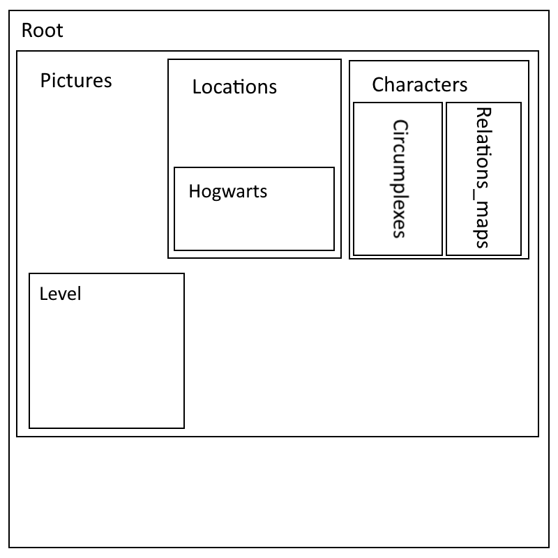

# DOD

#### Team Accio Niffler
- Michael Marchesan - 945887
- Giuliana Muto - 961902
- Luca Di Gennaro - 961208

- Creation Date: 18/10/2020
- Current Owner: Michael Marchesan
- Last Modification: 18/10/2020

## Revision history

- Michael Marchesan, 18/10/2020, file created.
- Michael Marchesan, 09/11/2020, revision before first update.

# Software List

#### Asset Editing Software

#### Development Software
Visual Studio 2019

#### Organization Software
Notepad++, Typora, Paint.net

#### Environments
Windows 10

# Data Types and Format

#### Diagrams
.drawio

#### Text
.md .docx

#### Pictures
.pdn, .png, .jpg

#### Video
.mkw, .mp4

#### Audio
.m4a

#### 3D Models
.obj

# Data Storage and Access
https://github.com/Sephirothbahamut/Accio-Niffler
Owned by Michael Marchesan

## Backup
Handled by github, with a local copy in each of our devices.

# Directory Structure

# File Naming Convention
Each file starts with capital letter; spaces are replaced by underscores.
