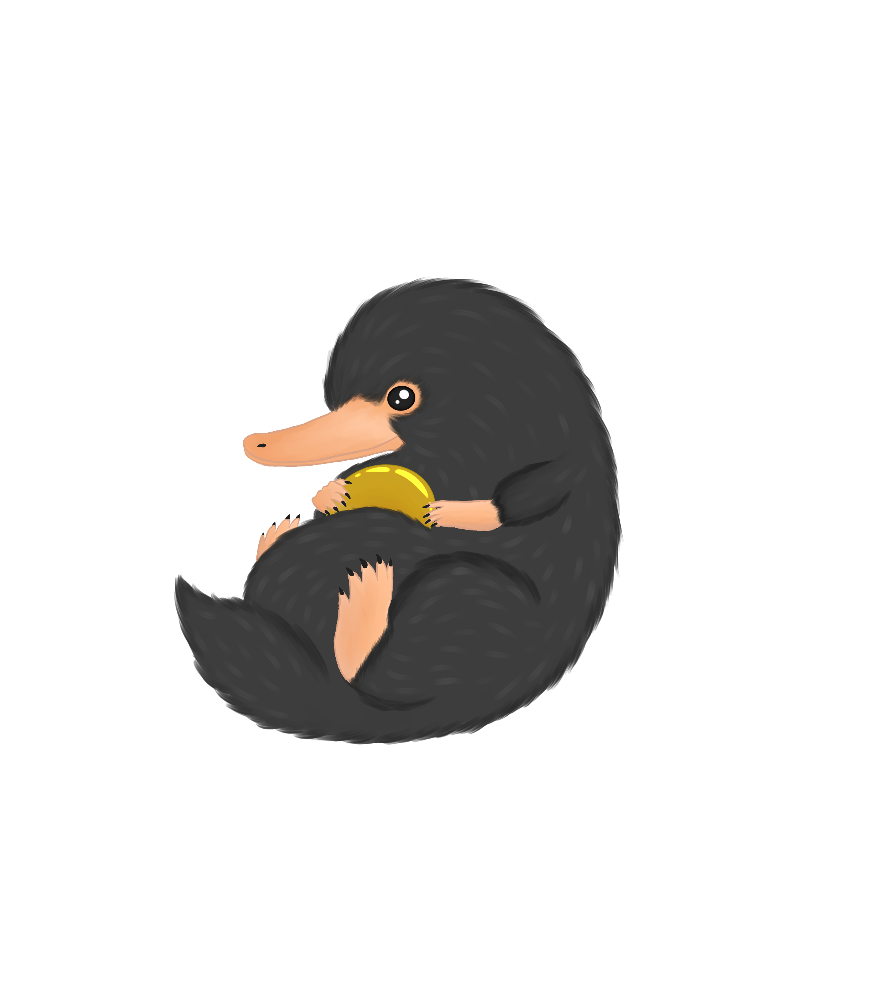
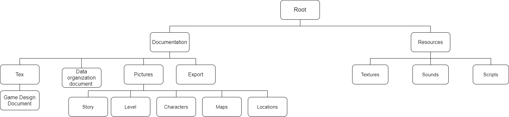

# DOD

#### Team Accio Niffler
- Michael Marchesan - 945887

- Giuliana Muto - 961902

- Luca Di Gennaro - 961208

  | **What**                                     | **When**   | **Who**  |
  | -------------------------------------------- | ---------- | -------- |
  | Document created                             | 18/10/2020 | Michael  |
  | Revision before first update                 | 09/11/2020 | Michael  |
  | Redesign of the document                     | 18/11/2020 | Luca     |
  | Directory Structure, File naming  convention | 19/11/2020 | Luca     |
  | Data storage and access                      | 20/11/2020 | Giuliana |
  | Data types and format                        | 21/11/2020 | Michael  |
  | Document preparation                         | 22/11/2020 | Giuliana |

## The dark lady awakens

#### Purpose

The purpose of this document is to...

#### Creation Date

Since 18/10/2020

#### Current owner

Michael Marchesan

#### Last Modification

Last Modification: 18/11/2020

## Revision history

- Michael Marchesan, 18/10/2020, file created.
- Michael Marchesan, 09/11/2020, revision before first update.
- Luca Di Gennaro, 18/11/2020, redesign of the document.

# Software List

#### Asset Editing Software

- RPGMaker MV 1.5
- Piskel 0.14.0
- Audacity 2.4.2

#### Development Software
- RPGMaker MV 1.5
  - Prototype
- Unity 2019.1.15f1 (Long Term Support)
  - Release
- Notepad++ 7.9.1
- Git 2.29.2.windows.2

#### Organization Software
- Notepad++ 7.9.1
- Typora 0.9.96 (beta)
- Paint.net 4.2.14
- Pandoc 2.11.1.1
- Microsoft Word 18.2008.12711.0
- Draw.io 13.9.9

#### Environments
- Windows 10 Pro 2004

# Data Types and Format

#### Diagrams
.drawio
	Save format for the draw.io website. Exported in .png
.png
	The image exported from draw.io files to be inserted in the documentation.

#### Text
.md 
	Pure markdown with no extensions for actual documentation.
.docx
	Temporary files to make documentation more aesthetically pleasing and export to .pdf in case a paged version is required from outside the team. NOTE: the .docx document must NOT change the actual textual content of the document. All content changes must be present in the .md file.

#### Pictures
.piskel
 - Piskel project format that keeps all the editing information.
.pdn
 - Paint.net format that keeps all the editing information.
.jpg and .png with no constraints
.png
 - Exported image.
 - All images have a 32 bits color depth.
 - Background images: 1024\*768
 - Tilesets: each tile is 48\*48 pixels. A tilesets must be at most 21 tiles wide and at most 21 tiles tall (to respect RPG Maker's tileset size constraint of 1024\*1024 pixels)
 - Iconset: each tile is 32\*32 pixels. An iconset must be at most 16 tiles wide, with no height limit.
 - Faceset: each tile is 144\*144. A faceset must be at most 4 tiles wide and at most 2 tiles tall.
 - Character set: each tile is 48\*48 pixels. A character set must be at most 12 tiles wide and 8 tiles tall. Each 3 horizontally consecutive tiles form a contiguous walking animation, with the 2nd one representing the idle state. 
   - For characters each 4 vertically consecutive groups of 3 tiles represent in order: walking down, walking left, walking right, and finally walking up.
   - For generic ambient items this constraint does not apply; an individual item like a boiling water pot can have just 3 horizontally consecutive times representing the animation.
	

#### Video
.mkv, .mp4
 - Resolution: 1920\*1080
 - FPS: 60
 - Audio Sample Rate: 48000 Hz
 - Audio Channels: Stereo

#### Audio
.ogg Vorbis Audio File
 - Audio Channels: Stereo
 - Sample Rate: 44100 Hz
 - NominalBitrate: 65600

#### Game data

- .rpgvxace
- .js

# Data Storage and Access

The team works on the different project's versions through a public repository but with modification permission only for team members. The repository is on Git Hub at the link https://github.com/Sephirothbahamut/Accio-Niffler owned by Michael Marchesan

## Backup

The backup is managed by the Git Hub repository. Each team members has an always up-to-date local copy of the project on their computer.

# Directory Structure

- **Root**
    - **Documentation**: holds all the files related to the game documentation, such as the Data Organization Document and the Level Design Document. Contains the markdown sources of the documents as well as the following sub-directories:
        - **Pictures** : holds all the pictures used in the documents. Its sub-directories serve to sort them into semantically-related sub-categories 
            - ***Story***
            - ***Level***
            - ***Maps***
            - ***Locations***
            - ***Characters***
              - ***Circumplexes***
              - ***Relation Maps***
              - ***Portraits***
        - **Export**: holds all the files generated from the markdown source of the documents, such as .docx and .pdf files 
    - **Resources**: holds all the files related to the game digital prototype. Its sub-directories serve to sort them into functionally-related sub-categories 
      - ***Textures***
      - ***Sounds***
        - ***Music***
        - ***Effects***
      - ***Scripts***

# File Naming Convention
Generally, each file starts with capital letter; spaces are replaced by underscores.

The filename represents its content in roughly two parts:

- The first part represents **what is contained** in the file or what it refers to (for example: Albus\_Dumbledore represents an asset concerning the character Albus Dumbledore, Black\_Lake\_ represents an asset concerning the Black Lake setting and so on...). It is composed by **no more than 3 words**, separated by underscores.
- The second part represents what **type** of content the file belongs to (for example: \_texture, \_sound, \_map, \_circumplex ...). It must be composed by only **one word** and it must be the **final** one of the filename: for this reason, abbreviations are allowed (for example: relationship map can be shortened to \_relmap) 

List of types to identify files:

- \_source
- \_diagram
- \_flowchart
- \_template
- \_circumplex
- \_portrait
- \_relmap
- \_map
- \_location
- \_level

Each diagram or flowchart must be **paired** with its source that generated it.

E.g.

- Albus_circumplex.png represents the character circumplex of Albus Dumbledore
- Myrtle_Ghost_portrait.png represents a portrait image of Myrtle in her ghostly form
- Minerva_after_event_relmap.png represents the relationship map of Minerva McGonagall after a traumatic event that happens through-out the story