# The Dark Lady Awakens

#### Team Accio Niffler
- Michael Marchesan - 945887

- Giuliana Muto - 961902

- Luca Di Gennaro - 961208

  | **What**                                     | **When**    | **Who**                  |
  | -------------------------------------------- | ----------- | ------------------------ |
  | Document created                             | 16/10/ 2020 | Michael                  |
  | Added High  concept                          | 16/10/2020  | Giuliana                 |
  | Added DOD                                    | 18/10/2020  | Michael                  |
  | Added settings                               | 18/10/ 2020 | Giuliana                 |
  | Added Minerva  pic, story and circumplex     | 19/10/2020  | Luca                     |
  | Added Albus  pic, story and circumplex       | 20/10/2020  | Luca                     |
  | Added Delphini  pic, story and circumplex    | 21/10/2020  | Luca                     |
  | Added story                                  | 21/10/2020  | Michael                  |
  | Added Tom pic,  story and circumplex         | 22/10/2020  | Luca                     |
  | Added Myrtle  pic, story and circumplex      | 21/10/2020  | Luca                     |
  | Added story  flowchart                       | 22/10/2020  | Michael                  |
  | Fixed high  concept                          | 22/10/2020  | Giuliana                 |
  | Added world map  and diagram                 | 23/10/2020  | Giuliana                 |
  | Reviewed  settings and high concept          | 25/10/2020  | Luca                     |
  | Added level                                  | 4/11/2020   | Giuliana                 |
  | Added shortened  story and level corrections | 5/11/2020   | Michael                  |
  | Added title                                  | 5/11/2020   | Michael, Luca,  Giuliana |
  | Added synopsis                               | 6/11/2020   | Michael                  |
  | Added goals                                  | 6/11/2020   | Luca                     |
  | Final review                                 | 8/11/2020   | Michael, Luca,  Giuliana |
  | Changed Level                                | 25/11/2020  | Giuliana                 |
  | Reviewed Level                               | 26/11/2020  | Luca                     |
  | Reviewed Level                               | 27/11/2020  | Michael                  |
  | Final review                                 | 28/11/2020  | Michael, Luca,  Giuliana |
  | Fixed Level                                  | 30/11/2020  | Giuliana                 |

# Game design section

## 1. High concept and themes

### High concept

"The dark lady awaknes" is a 2D-Rpg single player game. The game is set in the Hogwarts's school and its surroundings. The story revolves around Minerva McGonagall, a young promising witch studying hard to become a master of Transfiguration. During her seventh year, she will become friends with a peculiar student, Delphini Lestrange, whose life seems to be wrapped in mystery until her arrival at Hogwarts. Delphini's true goal, which Minerva is unaware of, is to find a promising student in order to help her father Tom Riddle win the First Wizarding War, hoping that will prevent the death of her parents.
Minerva will be shaken when her dear friend Myrtle is found dead in the girls' bathroom, with no suspect. With a void in her heart overwhelmed by sorrow and grief, she cries for help: Delphini and the professor Albus Dumbledore come to her aid in order to discover the truth and find the culprit. However, there was bad blood between Dumbledore and Delphini, since her very arrival at Hogwarts, leading to distrust amongst each other.
Minerva is forced to choose who to believe and discover the truth behind the crime through player's choices: you can take sides with Delphini or with Dumbledore

### Themes
- Friendship is powerful
  - Bonding with others is essential in order to overcome great obstacles and grow in one's life. In our case, the relationship between Minerva and Delphini can make the difference between the safety or the early demise of the Wizarding World as we know it.
- Question everything
  - It's easy to trust blindfully one person because of a blood or friendship relationship; however, one must always develop a critical eye and be ready to question everything and everyone. Minerva isn't aware she's being brutally manipulated by Delphini, as the latter is by her stepfather Rodolphus: only pondering on it can lead to an early discovery of an impending calamity.
- Mistakes happen, everyone deserves a second chance
  - If someone truly repents of his misdeeds, he should not be ostracized but helped to redeem himself. Even if Delphini manipulated Minerva, the latter recognizes it was because of her past and her father's influence, eventually forgiving her.
- Actions have consequences
  - Should Minerva blindly follow Delphini until the very end, she will become a death eater and join Tom Riddle in his escalation for power. On the other hand, if Minerva will be able to find fallacies or contradictions in Delphini's background and motivations, through clues or discussion, she might disrupt the foul plan, potentially saving her friend from hers lust for vengeance.

## 2. Game world & settings

### World Diagram

### World Maps

| *Legend* |                  |
| -------- | ---------------- |
| 1        | Hogwarts         |
| 2        | Quidditch pitch  |
| 3        | Forbidden forest |
| 4        | Black Lake       |
| 5        | Hogsmeade        |
| 6        | Diagon Alley     |

### Settings

####  Hogwarts

Hogwarts is a School of Witchcraft and Wizardry. It islocated in the Highlands Scots, in the United Kingdom. Surrounded by the Black Lake and the Forbidden Forest, the school's castle has its roots at the end of 10th century, which grandeur made it one of the most important schools in the magical world. On the outside, many towers connect the various rooms and halls. In addition, it is surrounded by a green meadow, a Quidditch pitch and other annexed structures, such as the "Keeper of the keys" hut, game and grounds and the green house, where Herbology lessons are held. On the inside, there are seven floors that host classrooms, four dormitories, one Great Hall, and other mysterious rooms. The school has 142 stairways, which each of them seems to have a life of its own as they have fun to change their position and cause poor students to go astray. It is wrapped by many magical protections, making it invisible to muggles: only wizards can live in this castle. 

#### Great Hall

The Great Hall is a common place, where all students, the professors, the principal and other staff members of the school gather for the various meals of the day. Furthermore, it acts as a study room, leisure room and ceremonies room. It is composed by four large tables placed vertically, one for each of the houses present in the school, and one large table placed horizontally for the professors and the principal. The Hall is illuminated by thousands of candles that make it cozy and warm for the students. On the ceiling, there is a sky created by a magic spell which mimics the outside. For each recurrence, the hall is embellished, like for Christmas or the Yule Ball. 

#### Classrooms

The classrooms are in various areas of the castle, both inside and outside. The lessons are usually divided into theoretical and practical: the classrooms hosting the practical lessons were embellished according to the topic of the lesson. A great example is Potion-Mixing Room, which has for each bench a cauldron where the student can mix up concoctions and other recipes. The classrooms outside the castle are the Herbology greenhouse and the Quidditch pitch for the Flying Broom lessons.

#### Dormitories

The students are sorted in one of the four Houses present at Hogwarts: Gryffindor, Hufflepuff, Ravenclaw, Slytherin. The Dormitories serve as bedrooms and as a meeting place for students from the same house. Each House is different from the other, in colors and values, and this is represented through decorations and through the students' uniforms.  The dormitories are entrusted to a professor and two prefects (two last year students chosen to enforce the rules within their house). The bedrooms are shared for multiple students with four-poster beds, except for the prefects who have their own private room.

#### Quidditch pitch

A huge pitch where students can play Quidditch and train themselves. It is oval in shape and is about 165 meters long by 60 meters wide. At each side there are three goal points of different heights, while below there is a sand area used to soften the falls of the goalkeepers. The surface of the pitch is usually grass, but in some cases, it can be sand or even water. There are several towers for spectators.

#### Chambers of Secrets

It's a secret room under the Hogwarts foundation. The entrance is in the girls' bathroom on the second floor and requires saying a secret word in parseltongue for the secret passage to open up. The room is gloomy and dark and has a long corridor where statues in the shape of a snake's head are placed on the sides. In the center stands a colossal statue by Salazar Slytherin, the ancestor and founder of the Slytherin house. 

#### Forbidden Forest

It is a large woodland that surrounds part of the castle. It is an area that holds many secret and dangerous wild creatures, such as werewolves, but also beneficial ones, like unicorns. It is also home to many villages, such as the centaur one who take care of the woods. The Forbidden Forest, however, is still considered a place that houses dark entities: as a matter of fact, at night it is impractical to walk in the forest, as if the trees hold inside all the darkness. Even during the day it is very difficult to walk along the path. It is for all these reasons that students are usually denied access to it.

#### Black Lake

A large obscure lake located south of the castle. It is home to various magical sea creatures such as giant squids, mermaids and many more. The seabed temperature is very low, making it a favorable place for algae and other underwater vegetation. Venturing too deep is dangerous since many were attacked and trapped by merpeople.

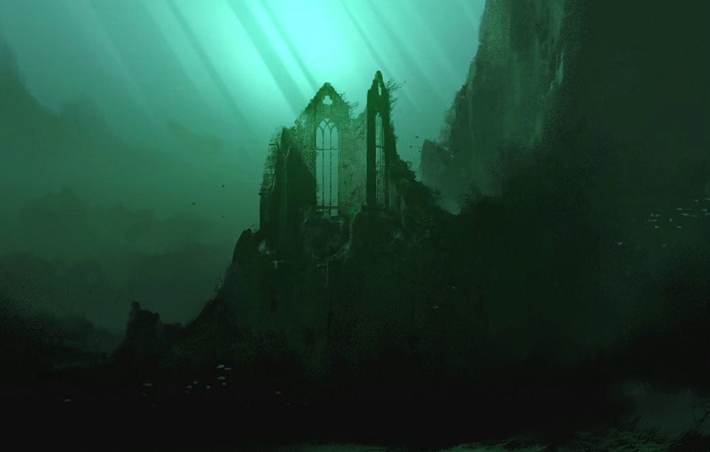

#### Hogsmeade

Picturesque little village near Hogwarts, inhabited only by wizards. Students can usually frequent it during holidays or weekends; they are easily attracted to this village because there are numerous entertainment places, such as pubs, shops. The most famous are The Three Broomsticks or the Zonko's jokes and tricks shop. It is also the terminal station of the Hogwarts Express. 

#### Diagon Alley

It's a magical side-street accessible from the muggle city London. To enter Diagon Alley, you need to give a tap on the right bricks of the wall behind Leakey Cauldron, which will move and reveal the entrance to the street. It can also be accessed via Flying Dust or dematerialization. The magic street has various important magical shops, such as Ollivander's Wand store.

##  3. Game story

### Synopsis

#### Introduction
Years after the Battle of Hogwarts, Delphini Lestrange meets her stepfather, who convinces her to embark in a mission into the past in order to save her family. She goes back thanks to a gifted timeturner and meets Minerva.

#### Daily life at Hogwarts
School starts and Minerva first meets Delphini as a new student in the Black Lake whereabouts. During the first part of the year Minerva deepens her relationship with Delphini as they meet toghether with Myrtle to study.

#### Petrified
Suddenly some students are found petrified around the school. The air is full of tension, and everything escalates when Myrtle is found petrified too. Minerva and Delphini start to investigate.

#### To Trust or Not to Trust
Tom Riddle accuses Hagrid of keeping in secret the monster who caused all the deaths. When Aragog was discovered, Hagrid is banished from the school despite Albus Dumbledore defending him. Delphini becomes suspicious of both Tom and Dumbledore. Hoever, she only talks to Minerva about the latter.

#### Final Confrontation
Minerva and Delphini reach Dumbledore's office, either to confront him (Minerva trusts Delphini), tell him the truth (Minerva trusts Dumbledore, Delphini's friendship is strong), or fight each other (Delphini's friendship is weak).

### Story

#### Background
Few years after the Battle of Hogwarts Delphini Lestrange is visited by her step-father Rodolphus Lestrange, who escaped from Azkaban to meet her and reveal that she was Voldemort's daughter.
Fast forward to 2007, Delphini learned a lot from her stepfather. He convinced her that had Voldemort won the First Wizarding War, the Second one would not have happened, and her family would still be alive. During her birthday, Rodolphus gifted her a Timeturner, a falsified Hogwarts Acceptance Letter for the year 1942, a mission, to find some powerful student to help Tom Riddle in the First Wizarding War, and a hope: to prevent the death of her family. 

#### Introduction
It's Minerva's 7th year at Hogwarts. She became acquainted with a new student: Delphini. Minerva had few friends; one was Myrtle Warren.

#### Rising Action
Minerva quickly got closer to Delphini, they started studying together. Sometimes Delphini would surprise her teaching her things she did not know. Delphini also helped her getting more familiar with the Animagus powers to which she had been introduced by her Transfiguration teacher, Dumbledore.
Meanwhile Delphini met her father, Tom Riddle. She told him about his future defeat during the First Wizarding War, then offered to help him winning it.
Dumbledore was secretly keeping an eye on Delphini, having found out her letter was falsified, and having troubles discovering anything about her past.

#### Climax
One day Delphini told Riddle about Slytherin's Chamber of Secrets. Riddle opened the Chamber and found the Basilisk. In the following days students were found petrified, causing an atmosphere of fear. All escalated when Myrtle was found petrified.

#### Falling Action
Minerva and Delphini started to investigate about what we're going on. Delphini began suspecting her father was behind the attacks, but never revealed these suspects.
When Tom Riddle found out about Hagrid keeping in secret an Acromantula, Aragog, in order to prevent the school from being shut he reported that to the headmaster of the school, Dippet, implying Aragog was behind the attacks. Hagrid was then expelled,  and the school remained open.
Riddle never told Delphini the truth, and she started suspecting Hagrid was the real villain. She began pushing the investigation towards that path  and started pointing out how Dumbledore kept defending Hagrid.

#### Resolution
At that point Minerva had to make a choice:
- **side with Delphini**
	- they go confront Dumbledore, who by then found out the truth about Delphini. Dumbledore tries to attack Delphini but retains from harming Minerva despite Minerva helping her friend. Finally, Minerva disarms Dumbledore, when suddenly Tom Riddle reaches the room and kills Albus.

- **side with Dumbledore; her relationship with Delphini is strong**
	- Delphini will follow Minerva to Dumbledore's office and reveal the truth about her admission, her mission, and reveal her suspicion about Riddle being behind the attacks. The three would be interrupted by Riddle, and a fight would start; as soon as Riddle realizes he is going to lose, he escapes in a cloud of smoke.

- **side with Dumbledore; her relationship with Delphini is weak**
	- Delphini will follow Minerva to Dumbledore's office pretending to be on her side, only to suddenly attack them both together with Riddle as soon as he walked past the door behind them.

### Story flowchart

## 4. Levels and goals outline

1. **A quick refresher (tutorial)** *[Hogwarts]*
   1. Reach the common hall
   2. Search for your friend Myrtle
   3. Help her revise for her next exam
      1. Practice common spells
      2. Look up on the books for basic potions and its ingredients
2. **A friend in need** *[Black Lake]*
   1. Reach the Black Lake shore to unwind a bit after all that study
   2. Approach the screaming girl
   3. Save Myrtle from the mermaid!
      1. Help the girl find her wand stolen by Grindylows
      2. Interrogate the Grindylows
      3. Reach the cave for clues
      4. Release Myrtle and fight the mermaid
   4. Bring Myrtle back to the infirmary
3. **Classes (minigames), exploration, shopping** *[Hogwarts, Quidditch Pitch, Hogsmeade, Diagon Alley]*
   1. Follow mandatory Transfiguration and Quidditch classes
4. **A night in the woods** *[Forbidden Forest]*
   1. Sneak past the professors and the prefects to get out the castle
   2. Meet up with Delphini and reach the Forbidden Forest
   3. Practice with her new spells
   4. Fight the enraged centaurs on the way back
5. **Preparing for greatness** *[Hogwarts]*
   1. Meet with Dumbledore in his office
   2. Scout for ingredients
      1. Get a mandrake leaf from the Herbology Lab
      2. Get a teaspoon of "unscathed" dew
      3. Get a chrysalis of a Death's-head Hawk Moth
6. **Classes (minigames), exploration, shopping** *[Hogwarts, Quidditch Pitch, Hogsmeade, Diagon Alley]*
7. **A cat-call**  *[Forbidden Forest, Hogwarts]*
   1. Complete the Animagus ritual in the Forbidden Forest
      1. Wait for the storm to begin
      2. Recite the incantation
   2. Escape the ambush
   3. Return to dorms
      1. Steal keys from the caretaker
      2. Sneak past the caretaker and the prefects
      3. (Optional) Help Delphini to return to her dorm unseen
8. **A ghastly moan** - **classes (minigames), exploration, shopping**  *[Hogwarts, Quidditch Pitch, Hogsmeade, Diagon Alley]*
   1. (Optional) Attend to the Quidditch tournament
   2. Look for Myrtle in the bathrooms in cat form to surprise her
      1. Escape and avoid the mysterious shadow
   3. Inform Dumbledore and Delphini of the incident
9. **Gnawing uncertainty** *[Hogwarts]*
   1. Investigate the bathrooms with Delphini for clues
   2. Confront Dumbledore on what happened to Hagrid
   3. Gather information on him with Delphini
   4. Discuss with Delphini
10. **The last stand** *[Dumbledore's office, Hogwarts]*
       1. Confront Dumbledore with the found clues
       2. Choose to believe Dumbledore or Delphini

## 5. Characters
### Minerva McGonagall

#### Description

Minerva is a black-haired half-blood witch, daughter of his muggle father and her witch mother.

She is a talented student at the Hogwarts School of Witchcraft and Wizardry: after an Hatstall, which took the Sorting Hat five and a half minutes to decide if she was Gryffindor or Ravenclaw, she was Sorted into Gryffindor House. 

Minerva is a Quidditch enthusiast and is particularly gifted at it too: this made her quite popular, letting her make a handful of friends including the shy and overlooked Myrtle Warren of the Ravenclaw House.

She has a soft spot for Transfiguration classes, a quality that made her the most outstanding student in this subject; her professor Dumbledore, charmed by her wits and her resourcefulness, decided to take her under his wing, ready to prepare Minerva for the greatest of the transfiguration skills: the Animagus transformation.

#### Backstory

Minerva was born in a complicated family: her father Robert was a muggle Reverend while her mother Isobel was a successful Hogwarts-educated witch. After many years she confessed to her husband, which remained shocked and speechless. The trust between the spouses suffered a heavy hit, however they decided to stay together for the sake of their love and their children.

This event left a scar in Minerva, making her aware of the difficulties of the relationship between muggles and wizards; for this reason, she tried her best to help his two brothers to accept and control their magic abilities while growing in an all-muggle world.

#### Circumplex

#### Map of relationships

After the premature death of her dear friend Myrtle:

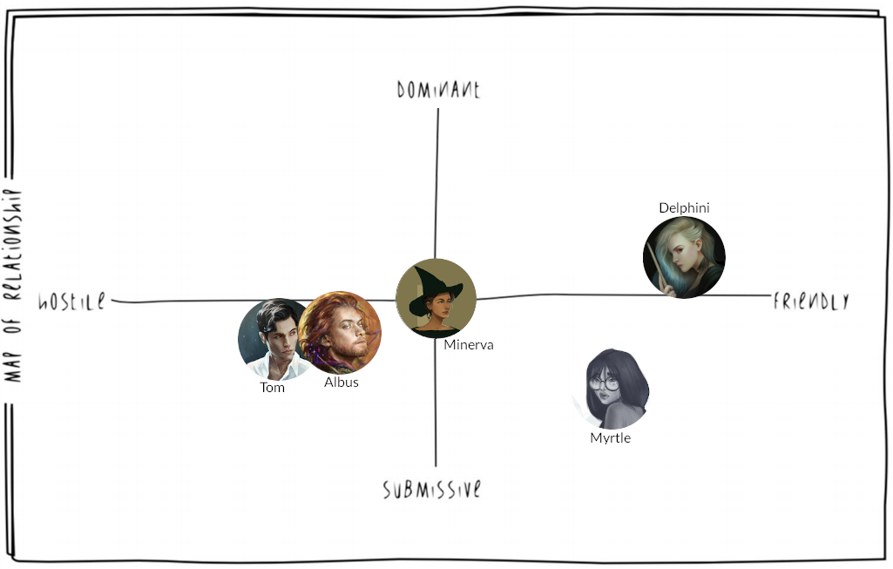

### Delphini Lestrange

#### Description

Delphini is a half-blood witch, born in secret in 1998 as the result of the relationship between Bellatrix Lestrange and Lord Voldemort. She appears as a pale girl, with silvery hair and blue tips.

After being grown and taught magic by Rodolphus, the husband of his mother Bellatrix, she is prepared and resolute about going into the past with the intent of changing the weave of fate, in order to avert his parents' premature death. Her mission is to try corrupt a young promising student into helping Tom Riddle, her father, win the First Wizarding War: that student will later be found in Minerva McGonagall. 

#### Backstory

Delphini was left orphan as a result of the Second Wizarding War: in her early years she was raised by Euphermia Rowle, a witch probably paid by her stepfather Rodolphus while he was convicted in Azkaban after the Battle of Hogwarts. For this reason, she did not attend Hogwarts and had little to no contact with other children: her main instruction came from her caretaker and Rodolphus himself, when he got released, making her a cold calculator just like her father.

#### Circumplex

#### Map of relationships

After Delphini changes her mind thanks to Minerva's friendship:

### Albus Dumbledore

#### Description

Albus Percival Wulfric Brian Dumbledore is an auburn-haired half-blood wizard.

He is currently teaching at Hogwarts: formerly a Defense against the Dark Arts professor, now presides over the Transfiguration class. Amongst its students we can find the proficient Minerva McGonagall, with whom he had developed a friendly mentorship, the eerie but clever Tom Riddle and the newcomer Delphini Lestrange, which sparked some suspicions because of her unusual arrival.

#### Backstory

Albus childhood was marked by tragedy by the attack of some muggle boys on her sister Ariana, who saw her performing magic and were frightened by what they saw. Some anti-muggle prejudice did develop in his early years, especially when he was in his relationship with Gellert Grindelwald, however he soon saw the error of his intent and changed his mind. This lead him to break his relationship with Grindelwald, followed by such a violent discussion that her sister Ariana was killed while trying to stop their fight. 

From that experience, Albus changed completely, repudiating any possible anti-muggle or mage-elitist movement and fighting against them.

#### Circumplex

#### Map of relationships

After Delphini changes her mind thanks to Minerva's friendship:

### Tom Riddle

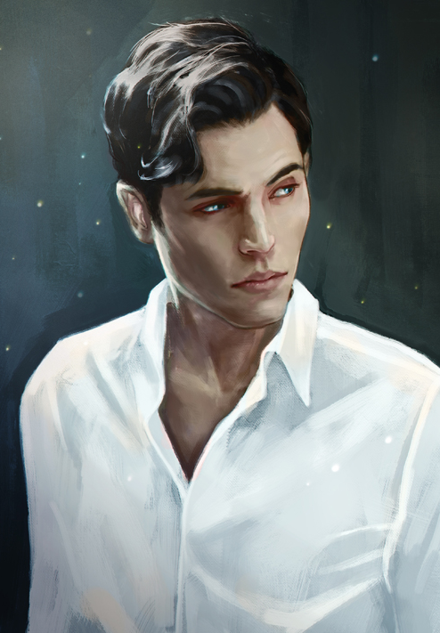

#### Description

Tom Marvolo Riddle is a black-haired half-blood wizard. He is currently a model student at Hogwarts where he was sorted into the Slytherin House, a nod to his ancestor Salazar Slytherin; there he gained the sympathy of many amongst the school's staff and students thanks to his particular charisma and oratory abilities, notably professor Slughorn. 

The sole exception to this was Dumbledore, who never forgot about his misdeeds at the orphanage, nor his unsettling behaviour during their first meeting: this made Tom realize his mistake of showing too much of his real self to Dumbledore, growing up to fear and despise him, unable to manipulate him anymore.

#### Backstory

Tom Riddle was born in an orphanage in London, where his mother died shortly after giving birth to him. He grew up completely unaware of his wizarding heritage until he discovered that he could make things move without touching them, speak to snakes and... "make bad things happen to mean people". He finally understood the meaning of that after the meeting with Dumbledore, which convinced him to deepen his knowledge at Hogwarts, albeit feeling hindered by the rules.

#### Circumplex

#### Map of relationships

### Myrtle Warren

#### Description

Myrtle Elizabeth Warren is a brown-haired muggle-born witch. She is currently a student at Hogwarts and was sorted into the house of Ravenclaw because of her witty and individual personality. However, this also backfired, as she was constantly bullied and mistreated for her peculiar aspect and temperament, gaining her the name of Moaning Myrtle because of her endless laments.

Nonetheless, she managed to make some friends, including the young Minerva McGonagall and the newcomer Delphini Lestrange.

As the events develop, she will die from the Basilisk petrifying stare, right after the opening of the Chamber of Secrets by the hand of Tom Riddle. She will return in a ghostly form, presiding the bathroom where she passed away. Talking to her about her death will only make her scream and disappear in tears.

#### Backstory

She was born in a rather normal muggle family, discovering in time about her magical capabilities and receiving the Hogwarts enrollment letter. Muggle-born people were always discriminated against because of their unusual heritage and Myrtle was no exception: adding this to her shyness and looks made her the laughingstock amongst her classmates.

#### Circumplex

#### Map of relationships

## 6. Gameplay Elements

In this section we will see in more detail all the aspect that make this video games unique in its genre. The game is a 2D single player third person game, the player will play with the character of Minerva, both in her human form and in "cat" form. The combat is turn-based and the formulation of the player's stats are based on the D&D rules.

In questa sezione vedremo più nel dettaglio tutti gli aspetti che rendono questo videogioco unico nel suo genere. Il videogioco è un RPG 2D in terza persona, il giocatore  giocherà con il personaggio di Minerva, sia in forma umana che in forma "gatto". Il combattimento è a turni e la formulazione delle statistiche del player sono basate sulle regole di D&D 

### Exploration mode

The player is free to move around  the map in both human form that cat form. If Delphini is also in the player's party, she will follow the player in his every move, but if he is in cat form and enters a place not accessible to humans, Delphini will remain waiting for him When the player is faced with a obstacle, mysterious object or secret passage, he can: 

- Use the spells that he has learning to solve the puzzle.
- Has the possibility of being able to use the transfiguration to transform small objects into somethings that is needed at the moment.
- Transform into cat form and reach places inaccessible to human.

The player can interact with NPCs:

- In human form he can talk to them, they can make funny story or riddles.
- In cat form he can be stroked.

Il player è libero di muoversi nella mappa sia in forma gatto che umana. Se nel party del giocatore c'è anche Delphini, lei seguirà il player in ogni suo movimento, ma se sarà in forma gatto ed entra in un posto non accessibile per gli umani, Delphini resterà ferma ad aspettarlo. Quando il player si trovat di fronte ad uno stacolo, un oggetto misterioso o un passaggio segreto può:

- Sfruttare gli incantesimi che ha imparato pe rpoter risolvere quel puzzle
- ha la possibilità di poter usare la trasfigurazione per poter trasformare piccolo oggetti in qualcoa di cui si ha bisogno in quel momento 
- potrà trasformarsi in forma gatto e raggiungere posti in casseibili normalmente.

Il player può interagire con gli altri NPC, in forma umana può parlare con gli NPC, i quali possono fare battute, discorsi senza senso oppure degli indovinelli, in fomra gatto può farsi accarezzare.

*Game: Doom & Destiny*

### Combat mode

Il sistema di combattimento è a turni con un solo cobattente autorizzato a compiere un'azione alla volta. All'inizio del combattimento personaggi e mostri vengono aggiunti alla scena e poi in base alle proprie statistiche viene scelto l'ordine di attacco. Quando nel party è presente anche Delphini il player può decidere solo l'azione di questo NPC, ovvero se attaccare oppure farle usare uno strumento. Quando il player decide l'azione di attacco per Delphini possono esserci due casi:

- Se il livello di amicizia è basso, l'attacco di Delphini è randomico.
- Se il livello di amicizia è alto, Delphini userà una spell per l'attacco combinato.

Il combattimento inoltre è in stile D&D, ma le regole sono state leggermente modificate per rendere il gioco fluibile e divertente.

*Game: Octopath traveler*

### Player rewards

The player's reward are obtainable in every fight. In the specific combat with Cerberus the player can get: 60 Galleon, 80 Sickle and 100 Knut

### Experience points and friendship experience

Characters gain Experience Points by completing challenges, missions and minigames (lessons). When Experience Points reach a certain treshold, the Character's level rises. 
Each level grants all the spells of that level which have already been seen during a lesson.

Delphini has an stat in Frienship Points. These increase and decrease depending on the player's choices and successes in missions involving Delphini.
//TODO *describe how delphini acts depending on friendship points*

### Gryffindor points

When the player completes a task really well (perfect score in minigames, extremely good timing in timed tasks etcc) or when he fails terribly, some points are added to or removed from the player's House. Sometimes player choices can affect the points of other houses as well.
Grants an achievement on the chosen game platform.

### Checkpoints 

Checkpoints are save points where the player can go back after a defeat. They appear as a Niffler statue which activates when the player makes an offer with a special coine called "Niffler Galleon".

### Saving 

Checkpoints also save the game. The player can still save at anytime through the main menu. During battles saving is disabled.

### Items

There are various items in the game. Some consumables to empower your wand, and some collectables like photos, rares, and story-related items.

#### Key items

- **Cauldron** 

  Un recipente usato per preparare gli incantesimi. Costa 25 galeoni quello "portatile". E' incantato e permette di essere rimpicciolito per portarlo in tasca comodamente e tirarlo fuori per creare pozioni al volo senza visitare l'aula di alchimia (pozioni).

  

- Book of Spells 
  A book worth 2 galleons, is used to keep track of the learnt spells.

  

- **Book of Potions**
  A book worth 2 galleons, is used to keep track of the learnt potion.

  

#### Consumables 

- **Money:**

  - **Galleon**
  - **Sickle**
  - **Knut**

- **Niffler Galleon**

  

  

- **Ingredients** 

  - **Ashwinder egg**

    Ashwinder eggs are the eggs of the Ashwinder , a magical serpent  which is born from the embers of an unattended magical fire.

    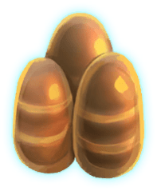

    

  - **Bezoar**

    A bezoar is a stone-like mass taken from the stomach of a goat, that acts as an antitode to most potions.

    

  - **Bitter root**

    Bitter root (alternatively spelled **bitterroot**) is a plant that can be used as a potion ingredient.

    

  - **Flobberworm Mucus**

    Flobberworm mucus, alternatively spelled **Flobberworm mucous** or **Flobber Mucus** for short, is the slimy green mucus exuded from the Flobberoworm, often used to thicken potions.

    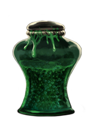

  - **Granian hair**

    Granian hair is hair taken from a Granian Winged horse, which can be used as a potion ingredient.

    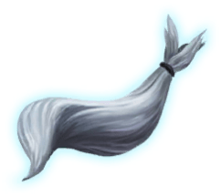

  - **Lavender**

    Lavender is a flower noted for its "beautiful colour" and "calming fragrance. It can be used as an ingredient in a variety of potions.

    

  - **Mistletoe berries**

    The berry of the mistletoe is small, white, and waxy. It is used as an ingredient in potion.

    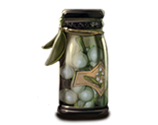

  - **Murtlap tentacle**

    A Murtlap tentacle is a rare potion ingredient that can be obtained from the growth on the back of a Murtlap.

    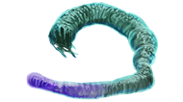

  - **Occamy eggshell**

    The eggof the Occamy has a shell made of puresilvwe, which accounts for why it is so much sought after.

    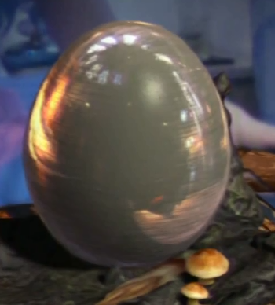

  - **Re'em blood**

    Re'em blood is the blood of a Re'em, which gives the drinker immense strength for a short time. This in turn makes Re'em blood a highly desired substance, and a useful potion.

    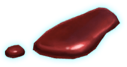

    

  - **Rue**

    Rue, also known as **common rue**, is a kind of evergreen shrubs native to the Mediterranean region, Macaronesia and southwest Asia, with a distinctive bitter taste.

    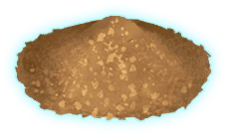

  - **Snowdrop** 

    This plant can be used in potion-making.

    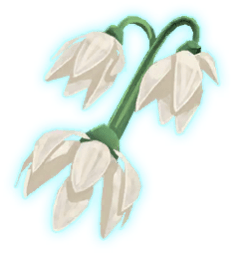

  - **Standard ingredient** 

    The Standard Ingredient is a herb, or mixture of dried herbs, with many magical applications and properties that is used as an ingredient in potion-making. 

    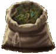

  - **Squill builb**

    The bulb of the squill is a structure that functions as food storage organs during the dormant state of the plant. Squill bulbs have potion-making properties and are best harvested just after the plants flower.

    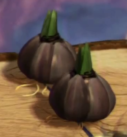

  - **Tincture of thyme**

    Thyme is a common herb with culinary and medicinal uses. Thyme can be used as a potion ingredient.

    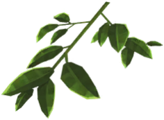

  - **Unicorn horn**

    The horn of a unicorn had magical properties that made it a useful ingredient in potions.

    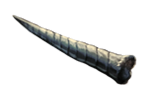

  - **Valerian Sprigs**

    Valerian is a plant with magical properties.

    

    

    

#### Craftables

- **Potions**
  Using a potion in battle requires an Action.

  - **Antidote common poisons**

  Neutralizes poisonous effects from magical creatures. Can be used both in battle and outside.
  Ingredients: Bezoar, Standard Ingredient, Unicorn Horn, Mistletoe Berries

  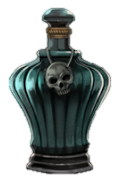

  - **Exstimulo Potion** 

  Increases the power of spells casted in the next 4 turns.
  Ingredients: Re'em blood, Granian hair, Snowdrop and Bitter root

    

  - **Felix Felicis**

  Makes who drinks it extremely lucky. Combat rewards are increased, healing potions effect is increased, and all rolls are rolled with advantage.
    Ingredients: Ashwinder egg, Squill builb, Murtlap tentacle, Tincture of thyme, Occamy eggshell, Powdered common rue.

- **Healing Potion**
  Recovers health points. This potion's effect varies based on the amount of ingredients used to prepare it. //TODO: how many ingredients define normal/medium/superior?

  | Rarity   | HP   | Luck | #    |
  | -------- | ---- | ---- | ---- |
  | Normal   | 2d4  | 8    | 1    |
  | Medium   | 4d4  | 16   | 3    |
  | Superior | 8d4  | 32   | 5    |

  

- **Invisibility Potion**

Makes the user invisible. In battle the potion lasts 3 turns, out of battle it lasts one minute. The potion affects the user and everything he's carrying; it terminates when the user attacks, casts a spell, or shifts form.
Ingredients: Flobberworm Mucus, Lavender, Valerian Sprigs, Standard ingredient

#### **Collectibles**

....

### Weapons and Armor

In Hogwarts, everything is based on wizardry and spells: for this reason the wand, together with protective jewelry, will play an important role in combat, enhancing the magical capabilities of our characters in different ways.

#### Wands

The wand is the most important tool in a wizard's life: inner magical power is channeled through it and it can cast any kind of spell. Each wand is made of wood and contains an enchanted core, a special material usually coming from magical creatures.

There are several types of wand wood and cores, which will alter and enhance the capabilities of the wielder.

##### Wood

- **Holly**

  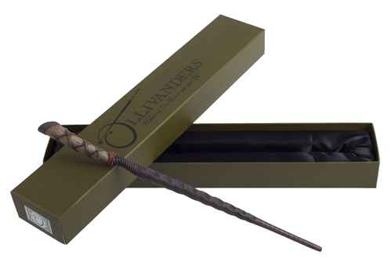

  - Holly will boost **defensive** spells, naturally meant for casters who think that a good defense is the best offense. 

- **Alder**

  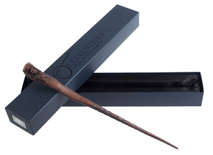

  - Alder will boost **buff** spells, aiding mages who seek to help and empower others.

- **Cedar**

  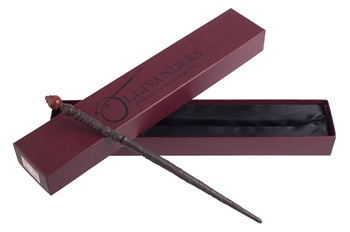

  - Cedar will boost **debuff** spells, perfect for wizards who prefer to weaken their enemies before striking.

- **Cherry**

  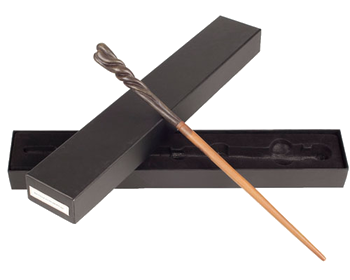

  - Cherry will boost **attack** spells, favored by sorcerers who follow the rule "strike first, strike hard"

- **Pine**

  

  - Pine will boost **utility** spells, preferred by creative enchanters and out-of-the-box thinkers

The **wood** will grant a bonus to its particular category of spells: 

- The bonus for non-Utility category will make spells of that category cast as 1 level higher (if applicable).
- The bonus for Utility category will grant an extra spell slot reserved to Utility spells for each spell level the character has access to.

##### Cores

Cores will grant an unique bonus feat

- **Dragon Heartstring** (***Dual wielder***)

  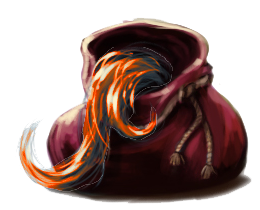

  - You can equip a second wand. You get the bonus from the wood of that wand, but not from its core.

- **Phoenix Feather** (***Alert***)

  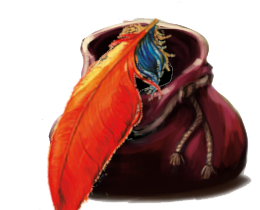

  - Adds +5 to Initiative

- **Unicorn Hair** (***Resilient***)

  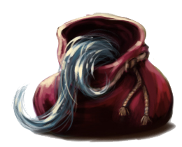

  - Adds +1 in one ability score and you gain proficiency in saving throws using that ability. 

- **Veela Hair** (***Healer***)

  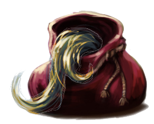

  - You can stabilize a creature and restore it to 1 hp, or restore [1d6+4+its number of Hit Dice] hp to it; can't be used more than once per day on the same creature.

- **Thestral Tail Hair** (***Lucky***)

  

  - You can reroll a d20 or force to reroll an attack roll against you. Can be used up to 3 times per day.

#### Amulets

Amulets will grant a bonus to the character ability scores. One can wear only an amulet at once of its choice.

- **Amber**, adds +1 STR

  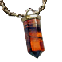

- **Jade**, adds +1 DEX

  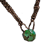

- **Lapis**, adds +1 INT

  

- **Paua**, adds +1 WIS

  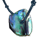

- **Coral**, adds +1 CON

  

- **Gold**, adds +1 CHA

  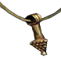

- **Onyx** (Rare), adds +1 to all ability scores

  

#### Rings

Rings will grant an unique bonus to the wearer. One can wear maximum two rings at once.

- **Paua**, gives 1 additional spell slot, usable by any spell of any level

  

- **Coral**, adds +8 HP

  

- **Moonstone**, adds +2 on CA and +2 on Saving Throws when defending against spell attacks.

  

- **Diamond**, adds +2 CA when defending against physical attacks

  

### 6.2 Gameplay characters 

### Abilities

### Secondary Abilities

### Stats

### Spells

 

### Skills 

#### Skill colldowns

#### Skill tree

#### Skill charts

#### Special skill tree

### Friendship

### Enemies chart

### 6.3 Combact mode

### roba

### 6.5 Minerva base stats

### 6.6 Delphini base stats

### 6.7 Cerberus mechanics 

# Level Design Section : "A cat-call"

In this section, we're going to describe in detail the seventh level of our game, named "A cat-call". 

## Level world

### Forbidden forest

The level is set in two different areas of the world: firstly, Minerva and Delphini go into the **Forbidden Forest** to complete the Animagus ritual together. 

The place is a thick forest, gloom in the day and even darker in the night. It could seem a quiet and calm place, but it hosts many dangerous creatures and inhabitants, as well as uncovered and, perhaps, wondrous secrets.

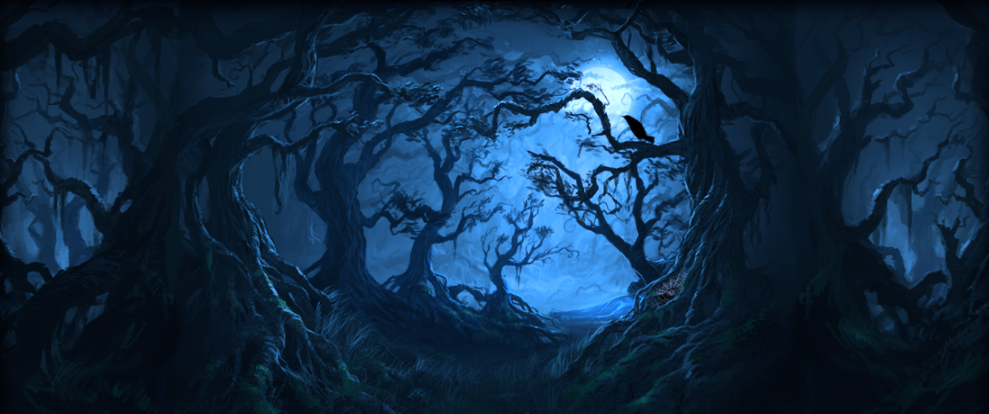

The creaky and crumpled trees, with their convoluted and gnarly branches, give an eerie feeling when paired with the *buzz* and *creaks* of various insects that dwell inside of them.

It is no mystery why this area was prohibited to normal students: yet, some of them still wander inside of it for sheer curiosity or in search for unturned, concealed secrets.

### Hogwarts' backdoor

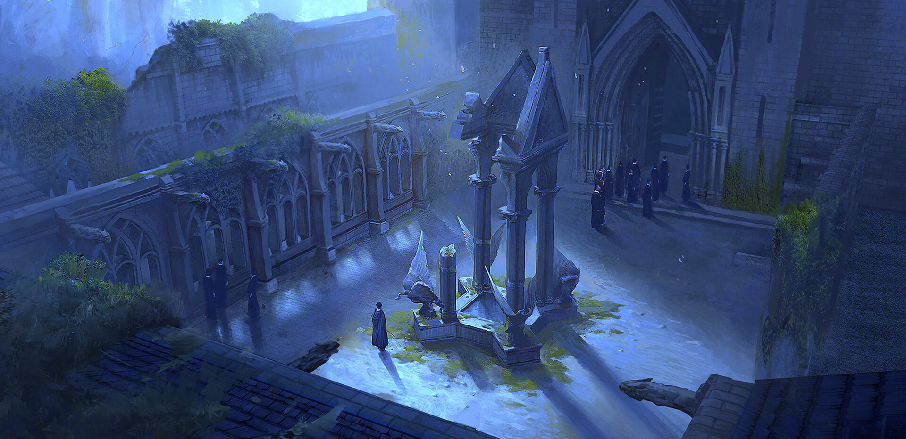

After that, they need to return to **Hogwarts** because the night is falling, especially they will sneak into the **castle's backdoor** and try to reach their **own House dormitory**.

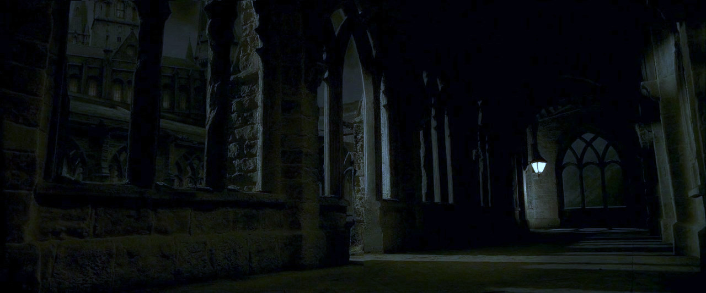

At night, the two protagonists will try to slip through the corridors of the medieval castle, trying to evade the prefects and the caretaker patrolling them.

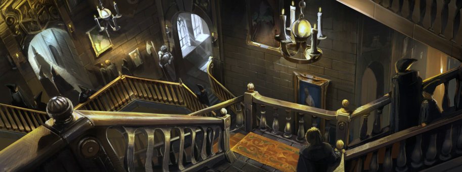

## Level Script

The sun is setting, and a storm is raging: the perfect climate to complete the Animagus ritual. Minerva and Delphini had reached the Forbidden Forest, a peaceful and isolated enough place for that purpose. Minerva casts the final spell, pronouncing increasingly loudly "Amato Animo Animato Animagus", with the wand pointing at her heart.

Finally, Minerva drinks the potion.

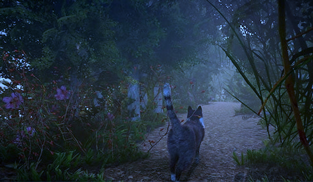

| Dialogue 1                                                   |
| ------------------------------------------------------------ |
| **Delphini**: I can't believe it! It really worked!          |
| **Minerva**: *Meow*                                          |
| **Delphini**: Aww... would you look at this cute cat! I guess I've never seen this "soft side" of yours, Minerva! |
Delphini outbursts in laughter, and looks at Minerva trying to get used to her new shape. She tries climbing on trees, jumping around the forest, to finally come back in her human form.

| Dialogue 2                                                   |
| ------------------------------------------------------------ |
| **Delphini**: Alright then, what does it feel like to be a furball? |
| **Minerva**: Oh come on! \*laughs\* If *anything*, as a cat I won't be forced to reply at your nonsensical provocations. |
| **Delphini**: As if, I'm fully aware you can't live without my Irish irony; and you know that too. |
| **Minerva**: You'd be surprised... Anyways, it's getting late, we should head back to the castle before it's night-time. |
The girls follow the path that goes back to the castle, until as they're about to leave the borders of the Forest, they're ambushed by a vicious three-headed dog, a Cerberus!

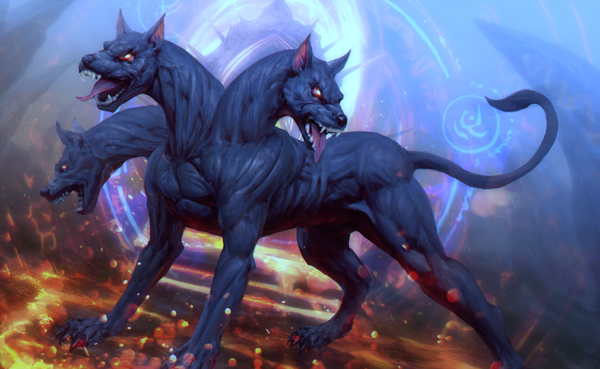

Quickly Minerva and Delphini prepare to fight it, wand in hand. Minerva tries to make her best use of spells and transfigurations, while Delphini tries to combine her spells with Minerva's. While fighting, Delphini suddenly remembers the weak point of the three-headed dog: a particular melody can be played in order to put the beast to sleep, making quick work of it.

In the end, they manage to defeat the Cerberus, either by putting it to sleep or by making him faint with other spells; the battle, however, took longer than expected: it's too late to get back in the Castle through the main gate, as the students are expected to not leave it during the night.

They rush up to the back entrance of the castle, where they discuss a plan to proceed without being caught by the caretaker or by the prefects.

| Dialogue 3                                                   |
| ------------------------------------------------------------ |
| **Minerva:** It's too late! It's already closed!             |
| **Delphini:** As if we didn't know it! Move, I'll show you how it's done! |

Delphini tries to cast the Alohomora spell, but the spell is deflected by a counter charm (the Anti-Alohomora charm).

| Dialogue 4                                                   |
| ------------------------------------------------------------ |
| **Minerva**: Parbleu! We're in danger, we must find a way to get in without being discovered... Think Minerva, think... |
| **Delphini**: Uhm... what about using your newly acquired powers to turn yourself into a cat and get in through the window? You should be able to open the door for me from the inside. |
| **Minerva**: That's a good idea but... I've just got started with the basics, I'm not confident I can keep that form for long enough... |
| **Delphini**: Let's hope it's enough. And please, for goodness' sake don't get caught! Be careful! |
Minerva nods, as she gets as close as possible to the entrance, and jumps while shifting to her cat form, ready to go through the window.

(Stamina-based puzzle)

Now Minerva in her cat form is inside the castle; she must take the backdoor's key from the caretaker. A stamina bar lets the player understand how long Minerva can stay in her cat form. When the stamina bar reaches zero, she turns back into her human form, hence must seek for an hiding spot to wait for the bar to recharge.

There are various corridors, some of which are dead-ends. Once the caretaker is found, Minerva must approach him in her cat form and try stealing the keys.

| Dialogue 5                                                   |
| ------------------------------------------------------------ |
| **Caretaker**: What a cute kitten... What are you doing here, are you lost? |
| **Minerva**: *Nya*                                           |
| **Caretaker**: You shouldn't wander around her-              |

As soon as Minerva is close enough, she jumps on the caretaker's head, disorienting him for a bit, and steals the keys from his belt in the commotion.

| Dialogue 6                                   |
| -------------------------------------------- |
| **Caretaker**: Come back you sneaky niffler! |

The caretaker is stunned for a bit so he shouldn't be a threat for now. Minerva can now open the door and let Delphini in.

| Dialogue 7                                                   |
| ------------------------------------------------------------ |
| **Delphini**: Finally you've done it! Did you find some milk on the way back? Maybe, a wool ball to play with? |
| **Minerva**: What? No, well... *casually*... I've found these keys, so here we are! |
| **Delphini**: Now we must head back to the dormitories. Have you noticed anyone besides the caretaker? |
| **Minerva**: So far nothing more than a mastiff furiously seeking for a black, cute little kitten, if you get what I mean. \*winks\*​​ |
| **Delphini**: Would you help me head back to my dormitory? *Unnoticed*, of course. |

Minerva has two options:

| Options                                                      |
| ------------------------------------------------------------ |
| **Option A**: "I'm not sure I can maintain my cat form long enough... I think we'll be safer if we just split here and head directly to our respective dormitories." |
| **Option B**: "Of course I will, you shouldn't even have asked! I'll let you know when the path is clear and you can reach me." |

Option A leads to an extremely easier level, as Minerva has to slip through the patrols as in the previous part; however this choice drastically decreases the friendship level with Delphini.
Option B leads to a longer and harder level, as Minerva has to first guide Delphini through the patrols up to Slytherin's dormitory, and then head back to her own one. If the player succeeds, the friendship level with Delphini increases.

If option B:

| Dialogue 8                                                   |
| ------------------------------------------------------------ |
| **Delphini**: I knew I could count on you. We must absolutely watch out for the mastiff, if he finds us it's over. We should avoid the prefects too, but I doubt they'll do anything more than directing us to the dormitory. I guess we have to follow their directions until they lose us. *~Now go, show me the path, and I shall be your shadow.*~ |

| Dialogue 9                                                   |
| ------------------------------------------------------------ |
| **Delphini**: You're good as a cat, are you sure you plan on keep studying magic? \*laughs\* |
| **Minerva**: \*meows angrily\*                               |
| **Delphini**: Geez, there's no need to take it personally... Thanks for the help, and good luck on the way back. See you tomorrow, *furball!* |

Then Minerva has to go back to Gryffindor's dorm.

A special bonus room contains one of the rare ingredients required for the Felix Felicis potion.

#### Puzzle Mechanics
Prefects won't be distinguishable from the caretaker from afar, as they all will wear a hood. Minerva can order Delphini to reach her by waving her tail or stop where she already is by keeping the tail still. Additionally she can distract the patrols to let Delphini move unnoticed.

If Delphini or Minerva (in human form) are caught by a prefect, he will force them to take different directions to each other's dormitories, proceeding until they're both out of the prefect's line of sight. That way Minerva will have to find another way to reach back to Delphini. Delphini after breaking LOS with prefects will hide in the nearest hiding spot, waiting for Minerva to find her and guide her towards safety.

If Delphini or Minerva (in human form) are caught by the caretaker, he will personally escort them to their rooms; the mission is considered failed, and the friendship level with Delphini will slightly decrease.

If Minerva is seen in her cat form by the caretaker the other instances will be disabled and the caretaker starts following you until you go out of his field of view.
If Minerva is caught the caretaker will

- the first time, throw her out of the castle (making her restart from the beginning). Delphini will hide in the nearest hiding spot from the location we left her.
- the second time, hit the cat with a wood log, subsequently causing Minerva to turn back in her human form as she doesn't have strong enough control over her animagus form. At the point, the mission fails with Minerva being dragged in her room, and the friendship level with Delphini decreasing.

If Minerva is caught in cat form by a prefect he will reach her and start petting her; during this time Minerva's cat-form points won't decrease and the prefect will be unable to see Delphini moving.

If the mission succeeds, the friendship level with Delphini increases a lot.

## 1. Detailed level diagram
## 2.  Detailed level description
 ### 2.1 Puzzles
 ### 2.2 Rewarding and teaching systems
## 3. Level flowchart(s
## 4. Event diagrams
## 5. Reference images, concept art, audio 

​	