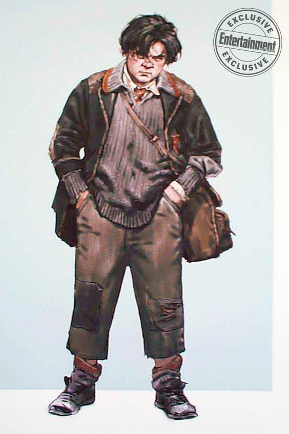

# Main story and detailed story of your level

## 1. High concept
"Minerva titolo" è un RPG single-player, top-down graphics e stile di combattimento D&D. Il gioco racconta di Delphini, viene affidata alla scuola di Hog, ma all'età di diciassette anni,  Rodolphus Lestrange gli racconta la verità sulla sua famiglia: i suoi genitori sono Voldermort e Bellatrix, gli viene affidato il Timeturner e un compito fondamentale: tornare indietro nel tempo, incontrare la maga più forte e portarla al lato oscuro (Rodo le insegnerà ad usare la magia perché lei non sapeva di essere una maga, gli dice che se Voldemort avesse vinto la prima guerra sarbbero morte meno persone).  Andrà nell'anno 1942, incontrerà  una giovane Minerva alle prese con la scuola di magia, vedrà in lei un forte potenziale e deciderà che sarà la sua preda. (cose da inserire, tra cui il rapporto con Dumbledore, scopo di Dephini e cose cosi) Nello scontro finale, il giocare dovrà scegliere se lottare a fianco della sua più cara amica o con Dumbledore.

## 2. Settings
###  Hogwarts

Hogwarts is a School of Witchcraft and Wizardry. It's located in the Highlands Scots, in the United Kingdom. Surrounded by the Black Lake and the Forbidden Forest, the school is a castle which has its roots at the end of 10th century, for all this time its grandeur made it one the school more important in the magical world. On the outside, there are many towers that connect the various areas, moreover it has many meadows, Quidditch pitch, and other annexed structures: like the hut of the Keeper of the keys, game and grounds and the green house, where the herbology lessons are held. On the inside, there are seven floors that host classrooms, four dormitories, one Great Hall, and other mysterious rooms. The school has of 142 stairways, each of them seems to have a live of its own as they have fun a change their position and cause poor students to go astray. And it is wrapped by many magical protections, making it invisible to Muggles, this means that only wizards live in the castle. 

### Great Hall

The Great Hall is a common place, where all students, the professors, the principal and other staff members of school, gather for the various meals of the day. Furthermore, acts as the study room, leisure room and ceremonies room. Its composed by four large table placed vertically, one for each of the houses present in the school, and one large table placed horizontally for the professors and the principal. The Hall is illuminated by thousands of candles that make it cozy and warm for the students. On the ceiling, there is a  sky created by an magic spell. For each recurrence the hall is embellished, like Christmas or the Yule Ball. 

### Classrooms

The classrooms are located in various castle zone, both inside and outside. The lessons inside the school, they are divided into theoretical and practical: the classrooms hosting the practical lessons were embellished according to the lessons, like the Potion-Mixing Room has for each bench has a cauldron where the student use it. The classrooms outside the castle, are the greenhouse and the Quidditch pitch for the lesson whit the broom.

### Dormitories

The students are sorted in one of the four Houses present at Hogwarts: Gryffindor, Hufflepuff, Ravenclaw, Slytherin  The Dormitorories serve as a meeting point for students  form the same house and for sleep. Each Houses is different, in particular for the colours because each houses are a different colours.  The dormitories is entrusted to a professor and two prefects (last year students chosen to enfoforce the rules within their house). The dormitories rooms are shared for multiple students with four-poster beds, except for the prefects who have their own private room.

### Quidditch pitch

Huge pitch where you play and train Quidditch. It's oval in shape, is about 165 meters long and about 60 meters wide, at each there are a three goal points of different heights, while below there is a sand area used to soften the falls of the goalkeepers. The surface of the pitch is usually gradd, but in some cases it can be sand or even water. There are several towers for spectators.

### Chambers of Secrets

It's a secret room under the Hohwarts foundation. The entrances are located in the girls' bathroom on the second floor and by saying a word in Parseltongue, a secret passage opens up. The room is gloomy and dark, has a long corridor where statues in the shape of a snake's head are placed on the sides. In the center stands a colossal statute by Salazar Serpevederde.It's a secret room under the Hohwarts foundation. The entrances are located in the girls' bathroom on the second floor and by saying a word in Parseltongue, a secret passage opens up. The room is gloomy and dark, has a long corridor where statues in the shape of a snake's head are placed on the sides. In the center stands a colossal statute by Salazar Serpevederde.

### Forbidden Forest

It is a large wood that surrounds part of the castle. It is an area that holds many secret and dangerous wild creatures, such as werewolves, it is also home to many villages, such as the centaurs who take care of the forest, but there are also beneficial creatures like unicorns. The Forbidden Forest, however, is considered a place that houses dark entities. At night it is impractical to walk in the forest, it is as if the trees hold back all the darkness making it a gloomy place. Even during the day it is very difficult to walk along the path. It is for all these reasons that students are denied access.

### Hogsmeade

Picturesque little village near Hogwarts, inhabited only by wizards. Students can go on holidays or weekends. Students are attracted to this village because there are numerous entertainment, pubs and shops, such as The Three Broomsticks or the Zonko's  joke shop. It is also the location of the station where the Hogwarts Express ends. 

### Diagon Alley

Is a magical street accessibile from muggle London, behind Leake Cauldron. To enter Diagon Alley, you need to give a tap for right bricks of the wall behind Leake Cauldron, which will move and reveal the entrance to the street. It can also be accessed via Flying Dust or Dematerialization. The magic street has varius important shop, such as Olivander's shop.

##  3. Synopsis
_max 250 words_
Atto 1: Introduzione
Atto 2: Vita a Hogwarts
Atto 3: Plot Twist
Atto 4.1 Scontro finale Delphini e Minerva contro Tom 
Atto 4.2 Scontro finale Delphini e Minerva contro Dumbledore

## 4. Story

#### Background

It's been few years since the Battle of Hogwarts which marked the end of the Second Wizarding War, when Delphini Lestrange receives an unexpected visit by her step-father Rodolphus Lestrange. He had escaped from Azkaban to meet her, and he came with ill plans. He reveled to Delphini that she was Voldemort's daughter, and began teaching her all he knew.
Fast forward to the year 2007, Delphini has learned a lot from her stepfather. He had convinced her that had Voldemort won the First Wizarding War, the Second one would have never happened, and all of her family would still be alive. During her birthday, Rodolphus gifted her a timeturner, a falsified Hogwarts School of Witchcraft and Wizardry Acceptance Letter for the year 1942, a mission, to find some promising and powerful student to help Tom Riddle in the First Wizarding War, and a hope: to prevent the death of her family members.

Greeting her step-father, Delphini used the timeturner to go back in 1942, and soon enough she settled on her target choice: Minerva McGonagall.

#### Introduction

It's Minerva's 7th year at  the Hogwarts School of Witchcraft and Wizardry. She quickly became acquainted with a new student: Delphini Lestrange. Minerva had few friends, one of which was Myrtle Warren (now 14 years old).
Minerva was the ideal student, investing most of her time focusing in her studies.

#### Rising Action

Minerva quickly got closer to Delphini and they started studying together. Sometimes Delphini would surprise her telling her about spells and concepts she was not aware about. In particular Delphini helped her getting more familiar with her Animagus powers to which she had already been introduced by her Transfiguration teacher, Albus Dumbledore.
In the meanwhile Delphini met her real father, Tom Riddle. She told him some things about the future, and began warning him about the opposition he would meet during the First Wizarding War, which would have led to his inevitable defeat; then offered to help him winning that war.
Dumbledore was secretly keeping an eye on Delphini, having found out her letter had been falsified, and having troubles discovering anything about her past.

#### Climax

One day Delphini told Riddle about Salazar Slytherin's Chamber of Secrets. Riddle opened the Chamber and found the Basilisk, left there from his ancestor Salazar. In the following days many students were found petrified around the school, causing a general atmosphere of fear amongst the students. It all escalated when the Basilisk petrified Minerva's best friend, Myrtle. There were voices about the school being shut down for the rest of the year.

#### Falling Action
Minerva and Delphini started to seriously investigate about what was going on. Delphini slowly started suspecting her father was behind the attacks, but never revealed her suspects.
When Tom Riddle found out about Rubeus Hagrid keeping in secret a pet Acromantula, named Aragog, in order to prevent the school from being shut down he reported that to the then headmaster of the school, Armando Dippet, implying that Aragog was behind the attacks. As a result Hagrid was expelled from the school and the school remained open.
Riddle never told Delphini the truth, and she started suspecting that Hagrid was the real villain. She began pushing the investigation with Minerva towards that path, and started pointing out how Albus Dumbledore kept defending Hagrid.

#### Resolution

At that point Minerva had to make a choice: support her Transfiguration teacher Albus Dumbledore, or her new friend Delphini?
If Minerva sides with Delphini they would go confront Dumbledore, who by then would have found out the truth about Delphini. Dumbledore tries to attack Delphini, but retains from harming Minerva despite Minerva helping her friend. Finally Minerva managed to disarm Dumbledore, when suddenly Tom Riddle emerged in the room to cast Avada Kedavra, killing Albus. Only then would Minerva realize what she had done.

If Minerva sides with Albus Dumbledore and her relationship with Delphini is strong, Delphini will follow her to Dumbledore's office and reveal the truth about her admission to Hogwarts, her mission given by her step-father, and reveal her suspicion about Tom Riddle being behind the attacks in the school. The three would be interrupted by Tom Riddle, and a fight would start; as soon as Tom realizes he is going to lose, he turns himself in a cloud of smoke an runs away.
If Minerva sides with Albus Dumbledore and her relationship with Delphini is weak, Delphini will follow her to Dumbledore's office pretending to be on her side, only to suddenly attack them both together with Riddle as soon as he walked past the door behind them.

## 5. Story flowchart

## 6. Themes
_max 250 words_

## 7. Characters
### Minerva McGonagall

#### Description

Minerva is a black-haired half-blood witch, the only daughter of his muggle father and her witch mother.

She is a talented student at the Hogwarts School of Witchcraft and Wizardry: after an Hatstall, which took the Sorting Hat five and a half minutes to decide if she was Gryffindor or Ravenclaw, she was Sorted into Gryffindor House. 

Minerva is a Quidditch enthusiast and is particularly gifted at it too: for this reason she is also an active member in the Gryffindor Quidditch Team. This made her quite popular, letting her make a handful of friends, including the shy and overlooked Myrtle Warren of the Ravenclaw House.

She has a soft spot for Transfiguration classes, a quality that made her the most outstanding student in this subject; her professor Dumbledore, charmed by her wits and her resourcefulness, decided to take her under his wing, ready to prepare Minerva for the greatest of the transfiguration skills: the Animagus transformation.

#### Backstory

Minerva was born in a complicated family: her father Robert was a muggle Reverend while her mother Isobel was a successful Hogwarts-educated witch. Her mother was moody for many reasons: since she married a muggle, she couldn't progress in her career and maintaining her magic abilities secret to his husband was no easy task. Isobel could not handle the pressure anymore and, in the end, confessed to Robert, which remained shocked and speechless. The trust between the spouses suffered a heavy hit, however they decided to stay together for the sake of their love and their children.

This event left a scar in Minerva, making her aware of the difficulties of the relationship between muggles and mages; for this reason, she tried her best to help his two brothers to accept and control their magic abilities while growing in an all-muggle world.

#### Circumplex

#### Map of relationships

### Delphini Lestrange

#### Description

#### Backstory

...

#### Circumplex

...

#### Map of relationships

....

### Albus Dumbledore

#### Description

Albus Percival Wulfric Brian Dumbledore is an auburn-haired half-blood wizard.

He is currently teaching at Hogwarts: formerly a Defense against the Dark Arts professor, now presides over the Transfiguration class. Amongst its students we can find the proficient Minerva McGonagall, with whom he had developed a friendly mentorship, the eerie but clever Tom Riddle and the newcomer Delphini Lestrange, which sparked some suspicions because of her unusual arrival.

#### Backstory

Albus childhood was marked by tragedy by the attack of some muggle boys on her sister Ariana, who saw her performing magic and were frightened by what they saw. Some anti-muggle prejudice did develop in his early years, especially when he was in his relationship with Gellert Grindelwald, however he soon saw the error of his intent and changed his mind. This lead him to break his relationship with Grindelwald, followed by such a violent discussion that her sister Ariana was killed while trying to stop their fight. 

From that experience, Albus changed completely, repudiating any possible anti-muggle or mage-elitist movement and fighting against them.

#### Circumplex

#### Map of relationships

### Tom Riddle

#### Description

#### Backstory

...

#### Circumplex

...

#### Map of relationships

....

### Myrtle Warren

#### Description

#### Backstory

...

#### Circumplex

...

#### Map of relationships

....

### Rubeus Hagrid

#### Description

...

#### Backstory

...

#### Circumplex

...

#### Map of relationships

....