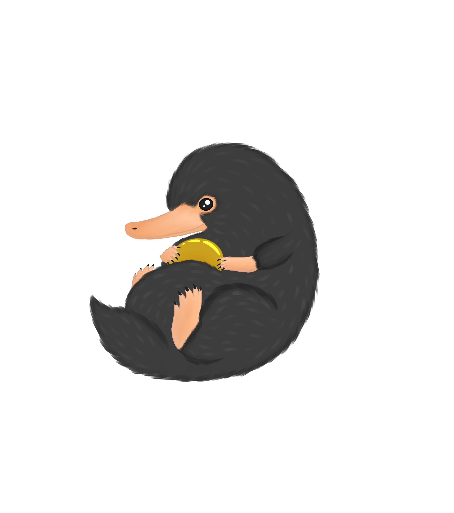
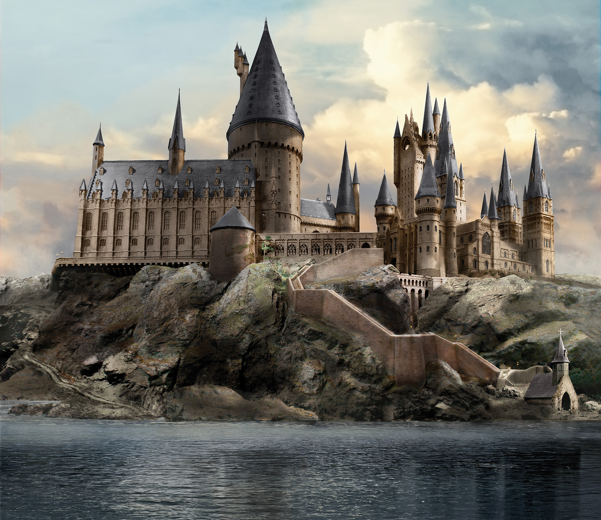
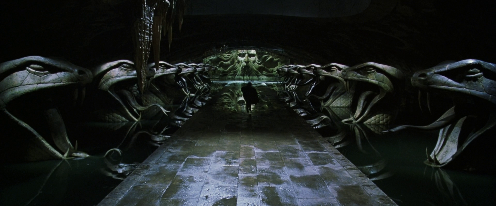
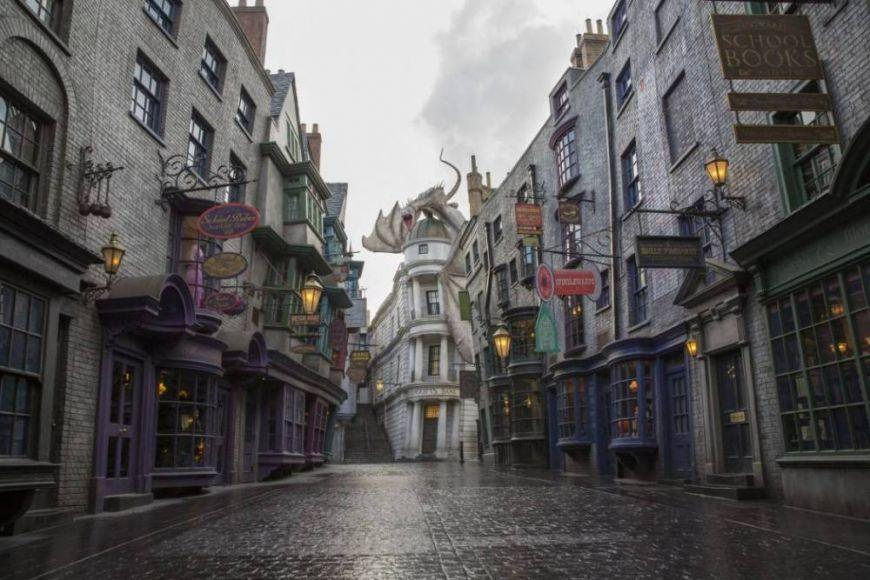
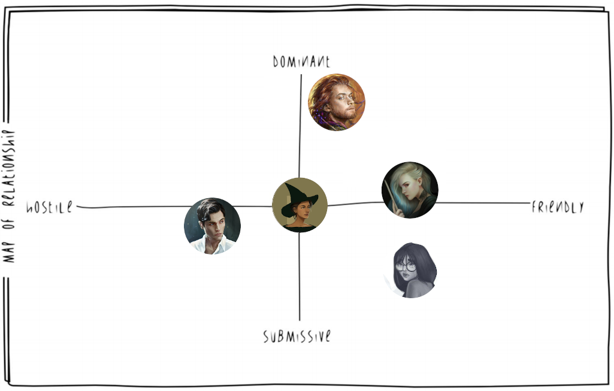
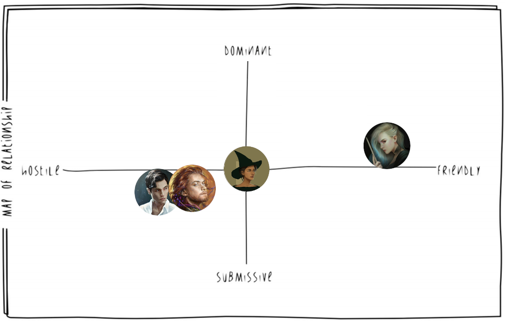
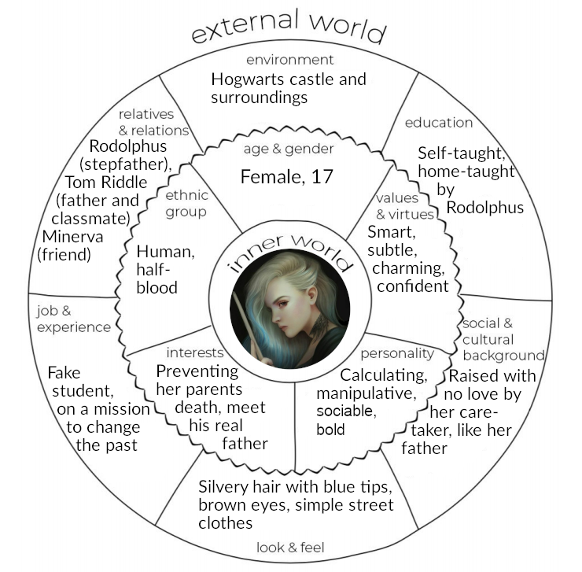
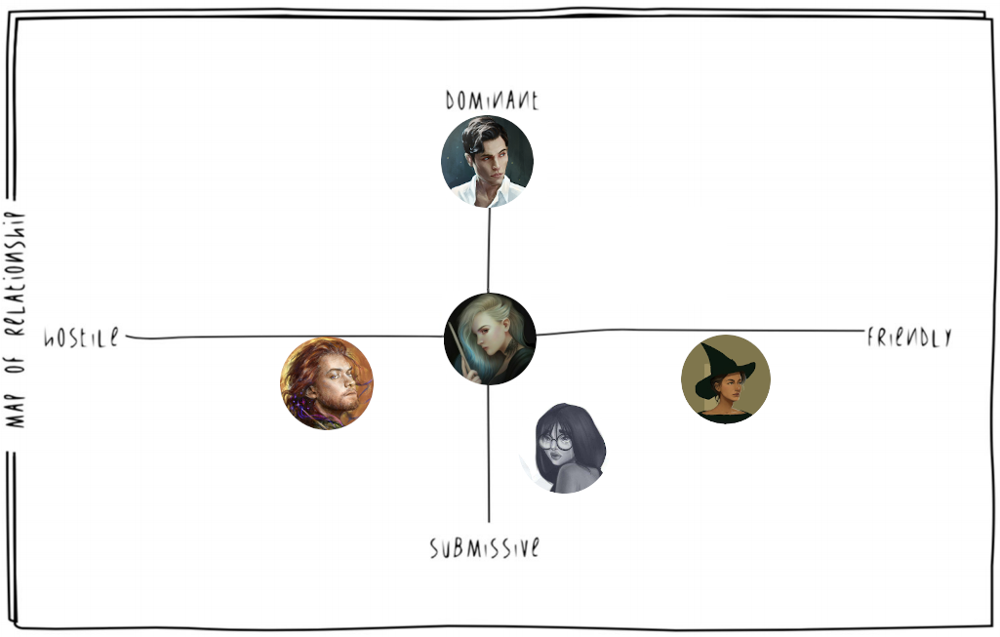
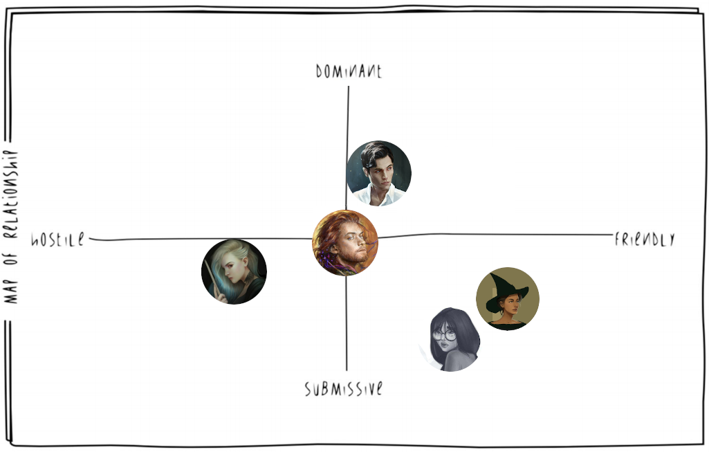
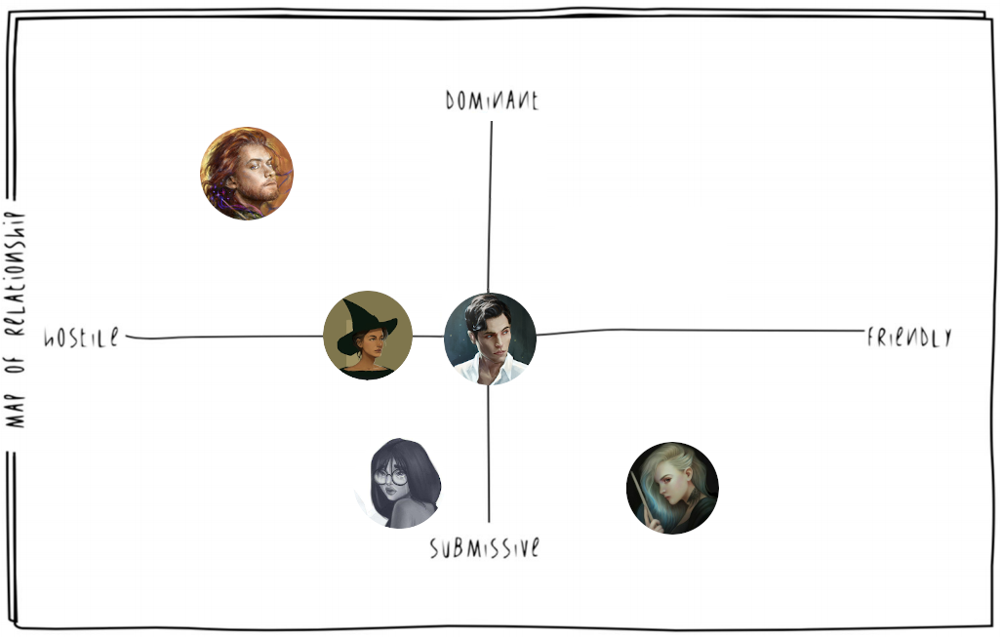

# Main story and detailed story of your level

## 1. High concept

"The Dark Lady awakens" is set in the Hogwarts's school and its surroundings. The story revolves around Minerva McGonagall, a young promising witch studying hard to become a master of Transfiguration. During her seventh year, she will become friends with a peculiar student, Delphini Lestrange, whose life seems to be wrapped in mystery since her arrival at Hogwarts. Minerva is unaware of Delphini's true intentions, whose only goal is to find a promising student in order to help her father, Tom Riddle, win the First Wizarding War, hoping that will prevent the death of her parents.
Minerva will be shaken during the same school year when she will come to know that her dear friend Myrtle is found dead in the girls' bathroom, with no suspect to accuse. With a void in her heart, which could never be filled, overwhelmed by sorrow and grief, she cries for help: Delphini and the professor Albus Dumbledore come to her aid in order to discover the truth and find the culprit. However, there is bad blood between Dumbledore and Delphini for several reasons, thus there is no doubt the two will blame each other for the events that happened.
Minerva is forced to choose who to believe and discover the truth behind the crime through the player's choices: will she side with Dumbledore or with Delphini? Will she be able to discover Delphini's plan and make her desist or she will fight her?

## 2. Settings
###  Hogwarts

Hogwarts is a School of Witchcraft and Wizardry. It's located in the Highlands Scots, in the United Kingdom. Surrounded by the Black Lake and the Forbidden Forest, the school's castle has its roots at the end of 10th century, which grandeur made it one of the most important schools in the magical world. On the outside, many towers connect the various rooms and halls. In addition, it is surrounded by a green meadow, a Quidditch pitch and other annexed structures, such as the "Keeper of the keys" hut, game and grounds and the green house, where Herbology lessons are held. On the inside, there are seven floors that host classrooms, four dormitories, one Great Hall, and other mysterious rooms. The school has 142 stairways, which each of them seems to have a life of its own as they have fun to change their position and cause poor students to go astray. It is wrapped by many magical protections, making it invisible to muggles: only wizards can live in this castle. 

### Great Hall

The Great Hall is a common place, where all students, the professors, the principal and other staff members of the school gather for the various meals of the day. Furthermore, it acts as a study room, leisure room and ceremonies room. It is composed by four large tables placed vertically, one for each of the houses present in the school, and one large table placed horizontally for the professors and the principal. The Hall is illuminated by thousands of candles that make it cozy and warm for the students. On the ceiling, there is a sky created by an magic spell which mimics the outside. For each recurrence the hall is embellished, like for Christmas or the Yule Ball. 

### Classrooms

The classrooms are located in various areas of the castle, both inside and outside. The lessons are usually divided into theoretical and practical: the classrooms hosting the practical lessons were embellished according to the topic of the lesson. A great example is Potion-Mixing Room, which has for each bench a cauldron where the student can mix up concoctions and other recipes. The classrooms outside the castle are the Herbology greenhouse and the Quidditch pitch for the Flying Broom lessons.

### Dormitories

The students are sorted in one of the four Houses present at Hogwarts: Gryffindor, Hufflepuff, Ravenclaw, Slytherin. The Dormitories serve as bedrooms and as a meeting place for students from the same house. Each House is different from the other, in colors and values, and this is represented through decorations and through the students' uniforms.  The dormitories are entrusted to a professor and two prefects (two last year students chosen to enforce the rules within their house). The bedrooms are shared for multiple students with four-poster beds, except for the prefects who have their own private room.

### Quidditch pitch

A huge pitch where students can play Quidditch and train themselves. It's oval in shape and is about 165 meters long by 60 meters wide. At each side there are three goal points of different heights, while below there is a sand area used to soften the falls of the goalkeepers. The surface of the pitch is usually grass, but in some cases it can be sand or even water. There are several towers for spectators.

### Chambers of Secrets

It's a secret room under the Hogwarts foundation. The entrance is located in the girls' bathroom on the second floor and requires saying a secret word in parseltongue for the secret passage to open up. The room is gloomy and dark, and has a long corridor where statues in the shape of a snake's head are placed on the sides. In the center stands a colossal statue by Salazar Slytherin, the ancestor and founder of the Slytherin house. 

### Forbidden Forest

It is a large woodland that surrounds part of the castle. It is an area that holds many secret and dangerous wild creatures, such as werewolves, but also beneficial ones, like unicorns. It is also home to many villages, such as the centaur one who take care of the woods. The Forbidden Forest, however, is still considered a place that houses dark entities: as a matter of fact at night it is impractical to walk in the forest, as if the trees hold inside all the darkness. Even during the day it is very difficult to walk along the path. It is for all these reasons that students are usually denied access to it.

### Black Lake

A large obscure lake located south of the castle. It is home to various magical sea creatures such as giant squids, mermaids and many more. The seabed temperature is very low, making it a favorable place for algae and other underwater vegetation. Venturing too deep is dangerous since many were attacked and trapped by merpeople.

### Hogsmeade

Picturesque little village near Hogwarts, inhabited only by wizards. Students can usually frequent it during holidays or weekends; they are easily attracted to this village because there are numerous entertainment places, such as pubs, shops. The most famous are The Three Broomsticks or the Zonko's jokes and tricks shop. It is also the terminal station of the Hogwarts Express. 

### Diagon Alley

It's a magical side-street accessible from the muggle city London. To enter Diagon Alley, you need to give a tap on the right bricks of the wall behind Leakey Cauldron, which will move and reveal the entrance to the street. It can also be accessed via Flying Dust or dematerialization. The magic street has various important magical shops, such as Ollivander's Wand store.

##  3. Synopsis
_max 250 words_
Atto 1: Introduzione
Atto 2: Vita a Hogwarts
Atto 3: Plot Twist
Atto 4.1 Scontro finale Delphini e Minerva contro Tom 
Atto 4.2 Scontro finale Delphini e Minerva contro Dumbledore

## 4. Story

#### Background

It's been few years since the Battle of Hogwarts which marked the end of the Second Wizarding War, when Delphini Lestrange receives an unexpected visit by her step-father Rodolphus Lestrange. He had escaped from Azkaban to meet her, and he came with ill plans. He reveled to Delphini that she was Voldemort's daughter, and began teaching her all he knew.
Fast forward to the year 2007, Delphini has learned a lot from her stepfather. He had convinced her that had Voldemort won the First Wizarding War, the Second one would have never happened, and all of her family would still be alive. During her birthday, Rodolphus gifted her a timeturner, a falsified Hogwarts School of Witchcraft and Wizardry Acceptance Letter for the year 1942, a mission, to find some promising and powerful student to help Tom Riddle in the First Wizarding War, and a hope: to prevent the death of her family members.

Greeting her step-father, Delphini used the timeturner to go back in 1942, and soon enough she settled on her target choice: Minerva McGonagall.

#### Introduction

It's Minerva's 7th year at  the Hogwarts School of Witchcraft and Wizardry. She quickly became acquainted with a new student: Delphini Lestrange. Minerva had few friends, one of which was Myrtle Warren (now 14 years old).
Minerva was the ideal student, investing most of her time focusing in her studies.

#### Rising Action

Minerva quickly got closer to Delphini and they started studying together. Sometimes Delphini would surprise her telling her about spells and concepts she was not aware about. In particular Delphini helped her getting more familiar with her Animagus powers to which she had already been introduced by her Transfiguration teacher, Albus Dumbledore.
In the meanwhile Delphini met her real father, Tom Riddle. She told him some things about the future, and began warning him about the opposition he would meet during the First Wizarding War, which would have led to his inevitable defeat; then offered to help him winning that war.
Dumbledore was secretly keeping an eye on Delphini, having found out her letter had been falsified, and having troubles discovering anything about her past.

#### Climax

One day Delphini told Riddle about Salazar Slytherin's Chamber of Secrets. Riddle opened the Chamber and found the Basilisk, left there from his ancestor Salazar. In the following days many students were found petrified around the school, causing a general atmosphere of fear amongst the students. It all escalated when the Basilisk petrified Minerva's best friend, Myrtle. There were voices about the school being shut down for the rest of the year.

#### Falling Action
Minerva and Delphini started to seriously investigate about what was going on. Delphini slowly started suspecting her father was behind the attacks, but never revealed her suspects.
When Tom Riddle found out about Rubeus Hagrid keeping in secret a pet Acromantula, named Aragog, in order to prevent the school from being shut down he reported that to the then headmaster of the school, Armando Dippet, implying that Aragog was behind the attacks. As a result Hagrid was expelled from the school and the school remained open.
Riddle never told Delphini the truth, and she started suspecting that Hagrid was the real villain. She began pushing the investigation with Minerva towards that path, and started pointing out how Albus Dumbledore kept defending Hagrid.

#### Resolution

At that point Minerva had to make a choice: support her Transfiguration teacher Albus Dumbledore, or her new friend Delphini?
If Minerva sides with Delphini they would go confront Dumbledore, who by then would have found out the truth about Delphini. Dumbledore tries to attack Delphini, but retains from harming Minerva despite Minerva helping her friend. Finally Minerva managed to disarm Dumbledore, when suddenly Tom Riddle emerged in the room to cast Avada Kedavra, killing Albus. Only then would Minerva realize what she had done.

If Minerva sides with Albus Dumbledore and her relationship with Delphini is strong, Delphini will follow her to Dumbledore's office and reveal the truth about her admission to Hogwarts, her mission given by her step-father, and reveal her suspicion about Tom Riddle being behind the attacks in the school. The three would be interrupted by Tom Riddle, and a fight would start; as soon as Tom realizes he is going to lose, he turns himself in a cloud of smoke an runs away.
If Minerva sides with Albus Dumbledore and her relationship with Delphini is weak, Delphini will follow her to Dumbledore's office pretending to be on her side, only to suddenly attack them both together with Riddle as soon as he walked past the door behind them.

## 5. Story flowchart

## 6. Themes
- Friendship is powerful
  - Bonding with other people is essential to overcome great obstacles and grow in one's life. In our case, the relationship between Minerva and Delphini can make the difference between the safety of the Wizarding World or **its early demise by the hand of Tom Riddle.**
- Question everything (poni tutto in discussione)
  - It's easy to trust blindfully one person because of a blood or friendly relationship; however one must always to develop a critical eye and ready to question everything and everyone. Minerva doesn't know that she is brutally manipulated by Delphini, as the latter is by her stepfather Rodolphus: only pondering on it can lead on an early discovery of an impending calamity.
- Mistakes happen, everyone deserve a second chance (mi convince poco)
  - If someone truly repents of its misdeeds, it should not be ostracized but helped to redeem itself. Even if Delphini manipulated Minerva, the latter recognizes that it was because of her past and her father influence and eventually forgives her.
- Actions have consequences
  - Every effect follow its cause. Shall Minerva follow Delphini blindly until the very end, she will become a death eater and join Tom Riddle in his escalation for power. On the other hand, if Minerva will be able to find fallacies or contradictions in Delphini's background and motivations, through clues or discussion, she might disrupt the foul plan, potentially saving her friend from vengeance lust.

## 7. Characters
### Minerva McGonagall

#### Description

Minerva is a black-haired half-blood witch, the only daughter of his muggle father and her witch mother.

She is a talented student at the Hogwarts School of Witchcraft and Wizardry: after an Hatstall, which took the Sorting Hat five and a half minutes to decide if she was Gryffindor or Ravenclaw, she was Sorted into Gryffindor House. 

Minerva is a Quidditch enthusiast and is particularly gifted at it too: this made her quite popular, letting her make a handful of friends, including the shy and overlooked Myrtle Warren of the Ravenclaw House.

She has a soft spot for Transfiguration classes, a quality that made her the most outstanding student in this subject; her professor Dumbledore, charmed by her wits and her resourcefulness, decided to take her under his wing, ready to prepare Minerva for the greatest of the transfiguration skills: the Animagus transformation.

#### Backstory

Minerva was born in a complicated family: her father Robert was a muggle Reverend while her mother Isobel was a successful Hogwarts-educated witch. After many years she confessed to her husband, which remained shocked and speechless. The trust between the spouses suffered a heavy hit, however they decided to stay together for the sake of their love and their children.

This event left a scar in Minerva, making her aware of the difficulties of the relationship between muggles and mages; for this reason, she tried her best to help his two brothers to accept and control their magic abilities while growing in an all-muggle world.

#### Circumplex

#### Map of relationships

After the premature death of her dear friend Myrtle:

### Delphini Lestrange

#### Description

Delphini is an half-blood witch, born in secret in 1998 as the result of the relationship between Bellatrix Lestrange and Lord Voldemort. She appears as a pale girl, with silvery hair and blue tips.

After being grown and taught magic by Rodolphus, the "official" husband of his mother Bellatrix, she is prepared and resolute about going into the past with the intent of changing the weave of fate, in order to avert his parents' premature death. Her mission is to try to corrupt a young promising student into helping Tom Riddle, her father, to win the First Wizarding War: that student will later be found in Minerva McGonagall. 

#### Backstory

Delphini was left as an orphan as a result of the Second Wizarding War: in her early years she was raised by Euphermia Rowle, a witch probably paid by her stepfather Rodolphus while he was convicted in Azkaban as a result of the Battle of Hogwarts. For this reason, she did not attend Hogwarts and had little to no contact with other children: her main instruction came from her caretaker and Rodolphus himself, when he got released, making her a cold calculator just like her father.

#### Circumplex

#### Map of relationships

After Delphini changes her mind thanks to Minerva's friendship:

### Albus Dumbledore

#### Description

Albus Percival Wulfric Brian Dumbledore is an auburn-haired half-blood wizard.

He is currently teaching at Hogwarts: formerly a Defense against the Dark Arts professor, now presides over the Transfiguration class. Amongst its students we can find the proficient Minerva McGonagall, with whom he had developed a friendly mentorship, the eerie but clever Tom Riddle and the newcomer Delphini Lestrange, which sparked some suspicions because of her unusual arrival.

#### Backstory

Albus childhood was marked by tragedy by the attack of some muggle boys on her sister Ariana, who saw her performing magic and were frightened by what they saw. Some anti-muggle prejudice did develop in his early years, especially when he was in his relationship with Gellert Grindelwald, however he soon saw the error of his intent and changed his mind. This lead him to break his relationship with Grindelwald, followed by such a violent discussion that her sister Ariana was killed while trying to stop their fight. 

From that experience, Albus changed completely, repudiating any possible anti-muggle or mage-elitist movement and fighting against them.

#### Circumplex

#### Map of relationships

After Delphini changes her mind thanks to Minerva's friendship:

### Tom Riddle

#### Description

Tom Marvolo Riddle is a black-haired half-blood wizard. He is currently a student at Hogwarts, where he was sorted into the Slytherin House, a nod to his ancestor Salazar Slytherin.

He is often seen as a "model scholar", gaining the sympathy of many amongst the Hogwarts staff and students, thanks to his particular charisma and oratory abilities, including professor Slughorn. 

The sole exception to this was Dumbledore, who never forgot about his misdeeds at his orphanage, nor his unsettling behaviour during their first meeting: this made Tom realize his mistake of showing too much of his real self to Dumbledore, growing up to fear and despise him, unable to manipulate him anymore.

#### Backstory

Tom Riddle was born in an orphanage in London, where his mother died shortly after giving birth to him. He grew up there completely unaware of his wizarding heritage until he discovered that he could "make things move without touching them, speak to snakes and... make bad things happen to mean people". He finally understood the meaning of that after the meeting with Dumbledore, which convinced him to deepen his knowledge at Hogwarts, albeit feeling hindered by the rules.

#### Circumplex

#### Map of relationships

### Myrtle Warren

#### Description

Myrtle Elizabeth Warren is a brown-haired muggle-born witch. She is currently a student at Hogwarts and was sorted into the house of Ravenclaw because of her witty and individual personality. However this also backfired, as she was constantly bullied and mistreated for her peculiar aspect and temperament, gaining her the name of Moaning Myrtle because of her endless laments.

Nonetheless, she managed to make some friends, including the young Minerva McGonagall and the newcomer Delphini Lestrange.

As the events develop, she will die from the Basilisk petrifying stare, right after the opening of the Chamber of Secrets by the hand of Tom Riddle. She'll return in a ghostly form, presiding the bathroom where she passed away

#### Backstory

She was born in a rather normal muggle family, discovering in time about her magical capabilities and receiving the Hogwarts enrollment letter. Muggle-born people were always discriminated against because of their unusual heritage and Myrtle was no exception: adding this to her shyness and looks made her the laughing stock amongst her classmates.

#### Circumplex

#### Map of relationships

<<<<<<< HEAD

# Level Script

#### Level 2: The kidnapping of Myrte and first meeting between Delphini and Minerva.

Minerva and Myrtle walk on the bridge that leads to the Black Lake, they decide to go there to relax after studying all day in the library. 

When they to arrive at shore they hear and quickly approaches: a girl being attacked by a mermaid. Minerva point the wand at the mermaid. 

| Dialogue 1.                  |
| ---------------------------- |
| **Minerva**: Stunning Spell! |

Minerva hits the mermaid, but the only thighs that happens is that the mermaid gets even more angry and lashes out of her and Myrtle. The mermaid kidnapping Myrtle and dive in the lake. Meanwhile, the girl tries to cast a spell, hits the mermaid, but a groups of Grindylows emerge from the waters, the Grindylows they hurl themselves on the girl and they steal her wand and they run away.

| Dialogue 2.                                                  |
| ------------------------------------------------------------ |
| **Mysterious Girl**: My wand!                                |
| **Minerva**: Myrtle, no!                                     |
| **Mysterious Girl**: Why my wand should be called Myrtle?    |
| **Minerva**: Myrtle is my friend! We must save her!          |
| **Mysterious Girl**: Good luck then.                         |
| **Minerva**: Can you help me?                                |
| **Mysterious Girl**: If you will help me find my wand, i will help you. |
| **Minerva**: Let's get to work.                              |

The two girls go in search of traces to find where the Grindylow is hidden. Minerva can use the spells to search the Grindylow. When they follow the footsteps, they understand that they must to go at left of the Black Lake.

While they search the wand, the Grindylows appears along the path and so they must defeat them. After defeating the Grindylows, they keep following the footsteps until the footsteps are finished, they understand that the wands is near.

| Dialogue 3.                                                  |
| ------------------------------------------------------------ |
| **Mysterious Girl**: Where the hell is my wand               |
| **Minerva**: Language!                                       |
| **Mysterious Girl**: May I ascertain the whereabouts of my hell-ish wand? |

While they search the wand, another  group of Grindylows attack. 

| Dialogue 4.                             |
| --------------------------------------- |
| **Mysterious Girl**: They have my wand! |

Minerva starts to attack holding her wand and defeats all enemies. With an Accio, Minerva retrieves the Mysterious girl's wand and hands it to her. A Grindylow tries to run away but the girl casts a Levicorpus (incantesimo creato da piton) and the creature is lifted upside down in the air.

| Dialogue 5.                                     |
| ----------------------------------------------- |
| **Mysterious Girl**: Tell me where is the girl! |

The Grindylow don't answer, then the girl  shake the wand and so the Grindylow 

| Dialogue 6.                                          |
| ---------------------------------------------------- |
| **Mysterious Girl**: Do you want me to vaporize you? |

The Grindylow scared, points the opposite shore of the lake. The girl then toss him away.

| Dialogue 7.                                                  |
| ------------------------------------------------------------ |
| **Minerva**:  Where did you learn that spell? I have never read about it in the books. |
| **Mysterious Girl**: In my country is a popular spell        |
| **Minerva**. Where are you from? And what's your name? I have never seen you before. |
| **Delphini**: My name is Delphini, and i form in...Irland and I'm a new student. |
| **Minerva**: Oh, that's why you have a strange accent        |

They are arrive of the opposite shore lake, they come across a cave

| Dialogue 8.                                    |
| ---------------------------------------------- |
| **Minerva**: Maybe, we have to enter the cave. |
| **Delphini**: Okay.                            |
| **Minerva**. Myrtle... i'm coming!             |

The girls enter in the cave and find the mermaid and near Myrtle. The combat is started, Minerva e Delphini fight the mermaid, defeat her and save Myrtle.

# World Diagram

# World Maps

| *Legend* |                 |
| -------- | --------------- |
| 1        | Hogwarts        |
| 2        | Quidditch pitch |
| 3        | Forbid forest   |
| 4        | Black Lake      |
| 5        | Hogsmeade       |
| 6        | Diagon Alley    |

# Goals outline

# Data organization document